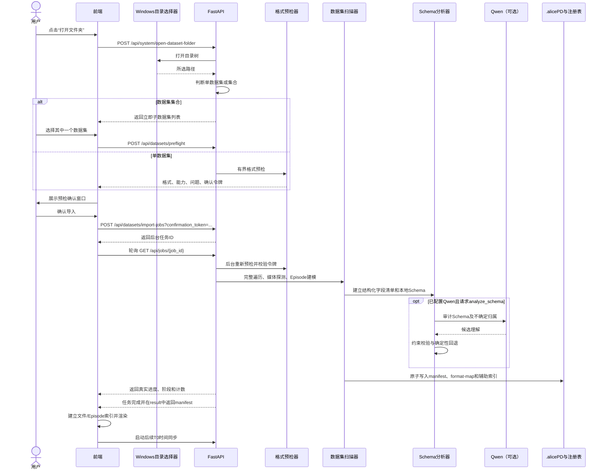

# Alice Blue 技术文档（01）：数据集载入

> 文档状态：依据当前工程实现编写
> 本章范围：从用户选择数据集目录，到数据集 `manifest` 建立、持久化并呈现在前端为止
> 不在本章展开：T0 时间同步、关节格式转换、C1–C3 质量检查、行为标注、坏帧编辑和数据导出

## 1. 本章要解决的问题

Alice Blue 面向的不是一种固定目录结构，而是多种来源、不同模态、不同时间轴的数据集。载入阶段不能只做“找到所有视频”，还必须回答以下问题：

1. 用户选择的是一个数据集，还是包含多个独立数据集的集合目录？
2. 数据属于哪一种已知格式，哪些能力可以安全启用？
3. 哪些文件属于同一个 Episode，哪些文件只是数据集级元数据？
4. 哪些视觉流可解码，哪一条作为 Episode 的主媒体？
5. 结构化文件里有哪些候选数据流，它们的字段、形状和数据类型是什么？
6. 如何在不修改源数据的前提下，保存索引、格式映射和后续派生结果？
7. 如何避免大型目录、不可用磁盘、网络目录和大量媒体探测拖慢界面？

因此，Alice Blue 将“载入”拆成目录发现、格式预检、用户确认、正式扫描、媒体探测、Episode 归属、Schema 清单和持久化八个阶段。

## 2. 设计原则

### 2.1 源数据只读

载入过程不复制、不重命名、不补零、不改写源文件。所有格式解释、索引、标注、缓存和导出结果都保存在数据集旁边的 `.alicePD` 派生目录中。工程自身的 `.vla_lens` 目录只保存轻量的注册指针。

### 2.2 先预检，后扫描

格式预检是有界抽样，不是正式扫描。它用于在读取整个大型数据集之前向用户说明：

- 识别到的格式；
- 预估的 Episode 布局；
- 识别到的模态；
- 可以使用和暂时不能使用的能力；
- 缺少标定、外参或字段时的风险。

只有用户确认预检结果后，后端才允许建立完整文件索引。

### 2.3 确定性规则优先

目录结构、文件名、采集元数据和真实解码结果是载入阶段的主要依据。Qwen 可以审计本地规则仍无法确定的结构，但不能覆盖本地已经确认的格式家族、能力矩阵和强 Episode 边界。

### 2.4 模态彼此隔离

RGB、Depth、Infrared、Joint、Action、Tactile/Pressure、IMU 和 Timestamp 保持为独立数据流。系统不会仅凭数组形状把深度当作 RGB，也不会把未知数组补零后冒充 MANO21 或 Action。

### 2.5 保留原生时间轴

载入阶段负责记录每条流的原生 FPS、帧数和时间戳依据，不对所有来源强制重采样。尤其是 Nexus，多相机和传感器可以具有不同频率，真正的跨流映射由载入之后的 T0 传感器对齐层完成。

## 3. 总体流程



载入成功的终点不是“所有后续分析已经完成”，而是系统已经得到一份可复现的逻辑数据集描述：文件有哪些、Episode 有哪些、媒体怎样读取、结构字段是什么、哪些能力当前可用。

## 4. 目录选择与懒加载

### 4.1 前端入口

前端入口是 `static/app.js` 中的 `openFolder()`。它调用：

```http
POST /api/system/open-dataset-folder?preflight_only=true
```

参数名虽然保留了 `preflight_only`，当前后端行为固定为“目录发现和预检”，不会从该接口直接完成导入。网页正式导入使用带确认令牌的后台任务 `/api/datasets/import-jobs`；同步 `/api/datasets/open-path` 继续保留给 CLI 和旧调用方。

### 4.2 Windows 目录选择器

`app/folder_dialog.py` 使用自定义 WinForms 目录树，而不是让程序在窗口打开时递归探测整个 Shell 命名空间。其性能策略如下：

- 创建目录节点时只加入一个 `Loading...` 占位子节点；
- 用户展开节点时，才枚举该目录的直接子目录；
- “此电脑”也只在用户展开时枚举磁盘；
- 跳过 `DriveInfo.IsReady == false` 的磁盘；
- 跳过带 Hidden 属性的目录；
- 目录枚举异常被局部隔离，不让整个选择窗口失去响应；
- PowerShell 子进程使用隐藏窗口运行，选择器自身保持置顶。

这个设计直接针对“大型磁盘、离线盘或网络目录导致打开文件夹窗口反应慢”的问题。它不会消除用户主动展开慢速目录时的 I/O 延迟，但避免了窗口初始化阶段扫描所有节点。

## 5. 单数据集与数据集集合

后端由 `app/storage.py::discover_dataset_roots()` 判断用户所选路径的语义。

### 5.1 自描述数据集根

`app/dataset_format.py::is_self_describing_dataset_root()` 在以下情况下将当前目录视为一个完整数据集：

- 满足 LeRobot 根目录特征；
- `dataset.json` 声明 Alice Full Schema；
- 根目录存在 `meta/metadata.json` 或 `metadata.json`；
- 大部分直接子目录形似 `ep_0001...` 或 `episode_1...`；
- 根目录直接存在视频或图片；
- 所有可见直接子目录都是 `camera`、`rgb`、`videos`、`mocap`、`tactile` 等已知模态目录，包括只有一个 `camera/` 或 `rgb/` 的情况。

Episode 子目录仍需占直接子目录的大约 70%；模态树则要求所有可见直接子目录都是已知模态，避免一个偶然同名目录把集合根误判为数据集。

### 5.2 集合目录

如果所选目录本身不具备上述自描述特征，则它的每个可见立即子目录被注册为一个候选独立数据集。此时后端返回：

```json
{
  "mode": "collection",
  "root_path": "D:/datasets",
  "dataset_count": 2,
  "datasets": [
    {"key": "...", "name": "task_a", "path": "D:/datasets/task_a", "status": "unloaded"},
    {"key": "...", "name": "task_b", "path": "D:/datasets/task_b", "status": "unloaded"}
  ]
}
```

集合模式有三个重要约束：

1. 只发现立即子目录，不在此阶段递归扫描每个数据集；
2. 每个子数据集第一次打开时，都要单独预检和确认；
3. 集合根不能通过正式导入接口合并成一个数据集，必须逐个导入候选子数据集。

前端 `installDatasetCollection()` 安装集合选择器，`loadCollectionDataset()` 按需加载子数据集。内存中最多缓存三份已载入 manifest，超过后按最早插入顺序淘汰，从而限制大型集合的浏览器内存占用。

## 6. 有界格式预检

### 6.1 预检入口

单独预检接口为：

```http
POST /api/datasets/preflight
Content-Type: application/json

{
  "path": "D:/dataset/task_a",
  "name": null,
  "analyze_schema": false,
  "camera_profile_id": null
}
```

后端调用链是：

```text
app/main.py::_dataset_format_preflight()
└─ app/dataset_format.py::inspect_dataset_format()
```

### 6.2 为什么称为“有界”

预检不会遍历完整数据集。它从最多 8 个代表性 Episode 目录出发，向下最多探索 3 层，总共最多收集约 500 个样本文件。它优先读取根级或代表 Episode 的采集元数据，再结合样本文件名和扩展名判断格式。

因此：

- `episode_count_hint` 是目录布局提示，不一定等于正式扫描后的 `episode_count`；
- `sampled_file_count` 不是数据集总文件数；
- 预检不生成完整 `files[]`，但会对代表视频和代表图片各最多解码一个；
- 只有正式扫描才能建立可审阅 Episode 和稳定文件索引。

代表媒体探测写入 `media_probe.video` 和 `media_probe.image`，状态为 `readable`、`unreadable` 或 `not_probed`。视频还记录 codec、尺寸和 FPS；图片记录尺寸和通道数。代表文件不可读会形成明确警告，但不会仅凭一个抽样文件把整个格式判为不可导入；正式扫描仍以实际可建立的可读 Episode 为硬条件。

### 6.3 格式识别顺序

当前实现按强特征优先识别：

| 格式家族 | 主要识别依据 | 典型置信度 |
|---|---|---:|
| `lerobot` | `meta/info.json`、`data/`、`videos/` 同时存在 | 0.99 |
| `alice_full` | `dataset.json` 声明 Alice Full Schema | 0.99 |
| `nexus_multimodal` | Nexus 版本或 v4 采集元数据结构 | 0.99 |
| `openxr` | 样本中出现符合 OpenXR 手追踪特征的文件 | 0.98 |
| `egodex` | 样本中出现 EgoDex 变换/关节文件特征 | 0.98 |
| `generic_multimodal` | 同时发现视觉文件和结构化文件 | 0.78 |
| `vision_only` | 只确认到视频或图像 | 0.72 |
| `unknown` | 无法确认可处理格式 | 0.20 |

格式预检还会生成：

- `declared_streams`：元数据或文件名探测得到的数据流；
- `modality_counts`、`kind_counts`：模态和类型统计；
- `processing_strategy`：该格式应采用的处理策略；
- `processing_mode`：后续空间坐标、关节适配和可见性检查必须遵守的格式模式契约；
- `camera_calibration`：相机标定和可选预设状态；
- `capabilities`：导入、VLM、叠加、深度、时间同步等能力；
- `issues`：`info`、`warning` 或 `error` 级问题；
- `status`：`ready`、`warning` 或 `blocked`；
- `confirmation_token`：本次预检快照的确认令牌。

`can_import` 的核心条件是存在可审阅视觉流：RGB、Infrared，或具备可靠几何描述并可解码的 Depth。只有无法安全建立视觉 Episode 的目录才会被阻止；某项下游能力缺失通常表现为警告和能力关闭，而不是伪造数据绕过检查。

### 6.4 格式模式契约：时间轴、关节语义和空间坐标必须分开

格式识别不是“看到 20/21/26 个点就猜一个适配器”。预检完成后，系统生成统一的 `processing_mode`，后续 T0、关节叠加、MANO21 适配和 C3 都必须读取同一份模式。模式冲突时进入保守的 `unknown`，关闭需要空间坐标假设的能力。

| 数据集模式 | 关节适配 | 原始关节空间 | 相机投影约定 | 外参要求 | 当前可用能力 |
|---|---|---|---|---|---|
| `egodex` | EgoDex 完整骨架 → MANO21 | Episode 内置世界/相机位姿约定 | HDF5 内置 camera pose + intrinsic | 不需要 Nexus 外参 | Joint 叠加、C3 整手可见性、EgoDex 投影修正 |
| `nexus_multimodal` | Nexus/DexWeaveG1 20 → MANO21 | Mocap/Tracking 空间 | 必须先做 Tracking → RGB 标定投影 | 需要已应用的手部相机外参；RGB-Depth 预设本身不等于手部外参 | T0、Nexus 触觉/压力、Nexus20 适配；当前不套用 EgoDex C3 |
| `openxr` | OpenXR 26 → MANO21 | OpenXR baseSpace | 必须先做 baseSpace → RGB 标定投影 | 需要明确的 OpenXR 到相机标定 | OpenXR 适配和时间对齐；当前不套用 EgoDex C3 |
| `lerobot` | 按 `meta/info.json` 声明读取 | 以导出元数据为准 | 以 LeRobot 元数据为准 | 不自动推断 | 结构读取和声明的导出能力 |
| `alice_full` | 按 Alice Full Schema 读取 | 以 schema 声明为准 | 以 schema/元数据为准 | 不自动推断 | 结构读取和兼容导出 |
| `generic_multimodal` / `unknown` | 不选择专用适配器 | 未确认 | 禁止空间投影假设 | 未确认 | 仅启用已验证的通用能力 |

必须遵守三个边界：

1. `MANO21 适配成功`只代表关节拓扑和点序已统一，不代表这些点已经在 RGB 相机坐标系中。
2. `RGB-Depth 外参`只解决 RGB 与深度相机之间的空间关系，不自动解决 Nexus Mocap、OpenXR baseSpace 或其他 Tracking 空间到 RGB 的关系。
3. T0 只建立时间映射，不负责把 Nexus、OpenXR 或其他数据集的空间坐标变换成 EgoDex 坐标。

如果 `manifest.format_family`、`format_map.format_family` 和 `processing_strategy.id` 互相矛盾，系统不会选择“看起来最像”的模式，而是记录冲突并停用需要投影的 C3/投影修正。无显式格式声明的旧 manifest 只保留兼容性的 HDF5 回退，不会影响已明确声明格式的安全边界。

### 6.5 相机预设只改变能力，不改写源文件

若某种格式要求用户选择相机预设，前端不会只在浏览器里修改能力矩阵。选择变化后会携带 `camera_profile_id` 重新请求预检，取得与该预设绑定的新能力矩阵和确认令牌。标定选择写入 sidecar 的格式报告和 manifest，不会写回源数据。

这里必须区分两类概念：

- 相机预设可以使特定 RGB–Depth 配准能力可用；
- 它不等于手部关节到相机坐标系的外参，也不能无条件使 Joint 画面投影可用。

## 7. 用户确认与确认令牌

前端 `confirmDatasetPreflight()` 展示格式、置信度、Episode 提示、模态、能力和问题。只有以下条件同时满足时，确认按钮才可用：

```text
status != blocked
AND capabilities.can_import == true
AND confirmation_token 存在
```

确认后，网页发送：

```http
POST /api/datasets/import-jobs?confirmation_token=<token>
Content-Type: application/json

{
  "path": "D:/dataset/task_a",
  "name": null,
  "analyze_schema": true,
  "camera_profile_id": null
}
```

接口立即返回 `kind=dataset_import` 的任务对象。前端随后轮询 `GET /api/jobs/{job_id}`，用任务中的 `progress`、`message`、`file_count`、`video_count` 和 `episode_count` 显示真实扫描阶段；成功时从 `result` 取得 manifest。任务支持通过通用取消接口协作终止。

`PathOpenRequest.analyze_schema` 默认是 `true`。单数据集入口保持该默认意图；集合模式为降低按需加载成本，当前显式传 `false`，用户后续仍可从界面单独运行 Qwen 结构理解。同步 `/api/datasets/open-path` 执行相同令牌校验，供 CLI 和兼容调用使用。

### 7.1 令牌怎样生成

令牌是以下信息的 SHA-256 摘要前 24 个十六进制字符：

- 规范化后的根路径；
- 格式家族；
- Episode 目录数量；
- 已确认的相机预设 ID，未选择时使用明确的空预设标记；
- 抽样文件和元数据文件的相对路径、大小、纳秒级修改时间；
- 最多 64 个直接子目录名称。

正式导入前，后端会重新执行一次预检并重新计算令牌。这样可以防止用户确认后目录内容发生变化，或客户端绕过预检直接请求扫描。

### 7.2 保护状态码

| HTTP 状态 | 条件 | 含义 |
|---:|---|---|
| `428` | 未提供 `confirmation_token` | 必须先完成预检和确认 |
| `409`（同步接口）或后台任务失败 | 重新预检后的令牌不一致 | 目录内容或相机预设已变化，必须重新确认 |
| `409` | 尝试直接导入集合根 | 必须逐个导入子数据集 |
| `422` | 预检为 `blocked` 或 `can_import=false` | 不能安全建立数据集索引 |
| `400` | 正式扫描中发生路径、读取或媒体建模错误 | 请求不能完成，例如没有可读视觉 Episode |

## 8. 正式扫描与文件索引

正式扫描由 `app/storage.py::scan_dataset()` 执行。

### 8.1 一次遍历

`_iter_dataset_files()` 使用显式栈和 `os.scandir()` 遍历目录，并复用 `DirEntry.stat()` 结果。关键行为如下：

- 不跟随符号链接；
- 单个目录无权访问或临时消失时跳过，不中断整次扫描；
- 剪枝 `.alicePD`、`.git`、`.venv`、`.vla_lens`、`node_modules`、`output` 和常见缓存目录；
- 避免完整扫描后再对所有文件执行第二次 `stat()`。

`.alice`、校验和、锁文件、`.COMPLETE`、`desktop.ini` 等属于辅助源文件。它们记录在 `auxiliary/source-files.json` 中，但不进入逻辑数据集的 `files[]`，也不会参与 Episode 建模。

### 8.2 稳定标识

文件 ID 由相对路径确定：

```text
file_id = SHA1(relative_path)[:16]
```

Episode ID 由逻辑分组键确定：

```text
episode_id = slug(last_component(group_key)) + "-" + SHA1(group_key)[:7]
```

数据集 ID 也具有确定性：优先复用注册表中规范源路径相同的现有 manifest；首次导入时使用数据集名 slug 与规范源路径 SHA-1 前 10 位组合。因此同一路径重复导入会复用 dataset ID、sidecar 和原 `created_at`，同时刷新 `updated_at`。文件 ID 和 Episode ID 在目录结构不变时也保持稳定。

### 8.3 文件记录

每个逻辑文件至少保存：

```json
{
  "id": "6f40c712d56f39a1",
  "name": "episode_000006.parquet",
  "relative_path": "data/chunk-000/episode_000006.parquet",
  "parent": "data/chunk-000",
  "extension": ".parquet",
  "size_bytes": 123456,
  "modified_at": "2026-08-12T08:00:00+00:00",
  "kind": "structured",
  "category": "sensor",
  "episode_key": "episode_6",
  "episode_token": "6",
  "episode_id": "episode_6-...",
  "canonical_kind": "joint",
  "modality": "pose",
  "side": "left",
  "role": "hand_skeleton"
}
```

示例只展示核心字段。实际记录还可带 `variant`、同步状态、源/存储/同步 FPS、规范化置信度和证据。

## 9. 文件规范化

扫描器先用扩展名给出物理类型：

- 视频：`video / vision`；
- 图片：`image / vision`；
- HDF5、Parquet、NumPy、CSV：`structured / sensor`；
- JSON、YAML 等：`metadata / metadata`；
- TXT、Markdown：`text / metadata`；
- 其他：`file / other`。

物理类型不足以表达语义，所以每个文件还经过 `describe_source()`，生成以下规范字段：

```text
canonical_kind, modality, side, role, variant,
synchronized, canonical_confidence, canonical_evidence,
source_fps, storage_fps, sync_fps
```

这一步把“文件是什么容器”和“里面的数据在系统中扮演什么角色”分开。例如 `.parquet` 只是容器，它可能承载 Joint、Action、Timestamp 或传感器数据；具体语义由采集元数据、格式适配器、路径和字段共同决定。

## 10. 媒体探测与 Episode 创建

### 10.1 视频

所有视频先按 `episode_key` 分组，再通过 OpenCV 读取：

- 是否可打开；
- FPS；
- 帧数；
- 宽和高；
- 由此计算的时长。

视频探测最多使用 8 个线程，实际线程数可由 `VLA_SCAN_WORKERS` 调整，但仍被限制在 1–8 之间。无法打开的视频保留在文件索引中，却不会被当作可审阅媒体流。一个分组至少需要一条可解码流，才能建立视频 Episode。

同一个 Episode 可以有多条 `media_streams`。主媒体选择优先级为：

1. 名称明确为 `head_rgb`、`rgb`、`main`、`color` 的 RGB；
2. 其他 RGB/Color；
3. Wrist 视频；
4. 普通视频；
5. Depth 或 Infrared。

主媒体只用于默认审阅入口，不会删除或覆盖其他媒体流。

### 10.2 图像目录

同一目录下的图片会聚合为一条图像媒体流。数字文件名和非数字文件名采用相同的 Episode 边界规则：优先使用最近的显式 `ep_*` / `episode_*` 目录，否则使用图片所在目录。扫描器读取排序后的第一张图片确认可解码并得到分辨率，当前图像流默认按 30 FPS 描述。

若同一 Episode 已有视频，图片流会合并到该 Episode 的 `media_streams`，不会额外创建一个以 `camera` 命名的错误 Episode。每张图片的文件记录也会获得对应 `episode_id`。没有显式 Episode 目录时，目录边界本身就是图像数据的确定性归属证据。

### 10.3 Raw Depth

无文件头的 `.raw` 深度流只有在以下条件都明确时才会解码：

- 宽度和高度有效；
- `dtype` 是可用的整数或浮点类型；
- 文件大小能被单帧字节数整除；
- 声明帧数与按大小推导的帧数一致，或没有声明帧数；
- FPS 有效。

否则该文件仍可被索引，但系统不会猜测其布局。可解码 Raw Depth 与 RGB 保持独立媒体流；它可以加入已有 Episode，也可以在没有其他视觉流时单独形成深度 Episode。

## 11. Episode 归属算法

Episode 归属由 `app/episode_resolver.py` 提供确定性基础。

### 11.1 Episode token

`episode_token()` 从以下证据提取编号：

- `ep_0001_20260710_141603`、`episode-12` 等目录名；
- `episode_12.parquet` 等文件名；
- 纯数字文件名；
- 去掉相机、左右手、Joint、Action 等噪声词后仅剩的唯一数字。

时间戳后缀被视为元数据，不会被误认为第二个 Episode 编号。

### 11.2 Episode key

`episode_key()` 形成逻辑分组边界：

- 明确的 Episode 目录是最强边界；
- LeRobot 的 `data/`、`videos/` 以及 Alice 扩展的 `body/` 中，同编号文件统一归到 `episode_N`；
- 对普通多模态树，先剥离路径尾部的 `camera`、`mocap`、`tactile`、`action` 等模态目录，再按 token 合并；
- 没有可靠 token 时，使用去扩展名的相对路径，避免任意猜测合并。

### 11.3 本地归属计划

`build_local_episode_plan()` 把文件分为：

- `groups`：有确定 Episode 证据的文件组；
- `shared_file_ids`：数据集级元数据或文本；
- `unassigned_file_ids`：无可靠归属证据的文件；
- `file_episode_assignments`：文件 ID 到可播放 Episode ID 的映射。

确定性组的置信度为 `1.0`。存在未归属文件时，状态是 `awaiting_qwen`，但已确认的组不会因此失效。

### 11.4 Qwen 只审计不确定部分

当 `analyze_schema=true` 且已经配置 Qwen 时，`app/main.py::_understand_manifest()` 可以提交结构清单，并在本地归属仍有未确定文件时提交一份有界 Episode 样本框架。Qwen 结果必须经过 `validate_qwen_episode_plan()`：

- 只能引用样本框架中真实存在的 `file_id`；
- 不能重复分配同一文件；
- 不能合并不同的非空 Episode token；
- 不能跨越多个原生数字 Episode 的任务作用域；
- 置信度低于 `0.72` 的组被拒绝；
- Qwen 遗漏或被拒绝的文件回退到确定性规则；
- 剩余无法确认的文件继续留在 `unassigned_file_ids`。

Qwen 同样不能改变本地预检确认的非 `unknown` 格式家族和能力矩阵。它是受约束的结构审计器，不是格式真值来源。没有配置 Qwen 时，载入仍可依靠本地 Schema 和确定性 Episode 归属正常完成。

## 12. 多频率时间轴

### 12.1 普通 Parquet 数据集

对于非 Nexus 数据集，如果 Episode 同时具有 Parquet 数据和媒体：

```text
data_frame_count = 该Episode相关Parquet长度的最大值
logical_frame_count = min(data_frame_count, primary_media_frame_count)
```

如果没有主媒体帧数，则逻辑帧数使用数据帧数。每条媒体流记录 `source_frame_count`，再裁到不超过逻辑帧数，并保存 `trimmed_media_frames` 等对齐信息。

这里的裁剪是 manifest 中的逻辑可索引范围，不会改写视频文件。

### 12.2 Nexus 多速率策略

Nexus 不走上述统一逻辑帧数策略。其原因是头部 RGB、腕部 RGB、原始深度、Mocap 和同步表可能有不同 FPS 和原生帧数。

载入阶段执行：

- 保留每条媒体流的原生 FPS 和解码帧数；
- 从 `video_timestamps.parquet` 读取各相机的 `camera`、`frame_idx`；
- 按相机各自的有效索引范围限制相应媒体流；
- 保留 `timestamp_unique_frame_count`、`trimmed_unindexed_frames` 等信息；
- 从 `sync.parquet` 记录 canonical 同步长度及可推导的同步 FPS；
- 在 `alignment.source` 中标记由后续 `sensor_alignment` 层负责映射。

因此，Nexus 载入完成不代表所有流已经被压成同一个 30 Hz 数组。载入的正确结果恰恰是保留多速率事实，并把跨流同步延后到 T0。

## 13. Schema 清单与本地理解

正式文件索引是完整的，但结构化字段探测继续采用分层有界抽样，避免对大型 HDF5、Parquet 或 NumPy 数据反复全量读取。

`app/schema_profiler.py` 的当前上限为：

| 项目 | 上限 |
|---|---:|
| 代表文件 | 300 |
| 代表目录 | 96 |
| 每目录文件 | 4 |
| 结构字段 | 600 |
| Episode 媒体样本 | 12 |

抽样不是简单取排序后的前 300 个文件。它先在目录间均匀抽样，再优先选择结构化文件、Schema/Metadata/Info/Episode/Manifest 类文件，并尽量覆盖不同扩展名。

当前可探测：

- JSON / JSONL；
- HDF5；
- Parquet；
- NPY / NPZ；
- CSV / TSV。

每个候选流保留真实 `source_path`、`field`、`shape`、`dtype`、本地推断的 kind/modality/side 和证据。媒体候选流则直接来自前面的真实解码结果，而不是根据文件名虚构帧数或尺寸。

`build_local_schema_profile()` 在不依赖 API 的情况下生成：

- 规范流列表；
- 视觉流与 Joint/传感器流的候选关联；
- 时间对齐策略；
- 格式、处理策略和能力矩阵；
- OpenXR 26→MANO21 或 Nexus 20→MANO21 等已识别适配器声明。

这里的“适配器声明”只说明后续读取该候选流时应采用什么转换，不表示载入阶段已经修改源数组。

## 14. Manifest 与 sidecar 持久化

### 14.1 目录布局

若源数据集为：

```text
D:/datasets/task_a/
```

派生目录通常位于：

```text
D:/datasets/.alicePD/<dataset-id>/
├─ dataset.json
├─ format-map.json
├─ annotations/
├─ cache/
├─ exports/
├─ auxiliary/
│  └─ source-files.json
├─ exclusions/
├─ indices/
│  └─ invalid/
└─ changes/
   ├─ records/
   └─ applied/
```

如果数据集路径本身是文件系统根目录，sidecar 才退回该根目录内的 `.alicePD`。正常数据集采用相邻目录，避免污染源目录内部结构。

工程运行目录保存：

```text
<工程>/.vla_lens/datasets/<dataset-id>.json
```

该文件是 `alicePD/registry-pointer/v1` 指针，记录源路径、sidecar 路径和真正的 manifest 路径，不复制完整数据集索引。

### 14.2 核心 manifest

`dataset.json` 的核心结构如下：

```json
{
  "id": "task-a-3f82a941",
  "name": "task_a",
  "root_path": "D:/datasets/task_a",
  "sidecar_path": "D:/datasets/.alicePD/task-a-3f82a941",
  "created_at": "2026-08-12T08:00:00+00:00",
  "updated_at": "2026-08-13T08:00:00+00:00",
  "format_family": "nexus_multimodal",
  "episode_count": 6,
  "frame_count": 18000,
  "file_count": 84,
  "total_size": 1234567890,
  "episodes": ["...Episode对象..."],
  "files": ["...文件对象..."],
  "episode_resolution": {"source": "deterministic", "groups": []},
  "format_map": {"capabilities": {}, "issues": []},
  "camera_calibration": {},
  "schema_profile": {"status": "completed", "inventory": {}}
}
```

上例中的数字和 ID 仅用于说明结构，不代表固定值。`frame_count` 是各 Episode 当前逻辑帧数之和；在 Nexus 中，各 `media_streams` 仍然保留独立帧数。

### 14.3 原子写入

JSON 持久化先写入同目录的 `.tmp` 文件，再用 `replace` 替换目标文件。`dataset.json`、注册指针和辅助索引因此不会在正常写入过程中暴露半份 JSON。进程级锁用于串行化 manifest 和注册指针更新。

## 15. 前端接收 manifest 后做什么

`static/app.js::renderDataset()` 将后端 manifest 安装为当前数据集，并建立：

- `file_id -> file` 的内存索引；
- `episode_id -> episode` 的内存索引；
- 文件树分组和折叠状态；
- 数据集概要、格式策略、sidecar、Schema 和能力显示。

文件数大于 500 时，文件树默认采用自动折叠策略。载入结束后前端会启用后续操作，并立即把 T0 传感器时间同步排在后续处理之前。

这说明 `renderDataset()` 是本章和下一章的边界：此时数据集已经可以浏览，但统一时间轴、质量检查、标注和导出尚未完成。

## 16. API 契约汇总

| 方法与路径 | 用途 | 是否写入 sidecar |
|---|---|---|
| `POST /api/system/open-dataset-folder` | 打开 Windows 目录选择器并发现单数据集/集合 | 否 |
| `POST /api/datasets/preflight` | 对指定路径执行有界格式预检 | 否 |
| `POST /api/datasets/import-jobs?confirmation_token=...` | 网页提交可取消的后台正式扫描 | 完成时写入 |
| `POST /api/datasets/open-path?confirmation_token=...` | CLI/兼容调用同步校验并正式扫描 | 是 |
| `GET /api/jobs/{job_id}` | 读取导入阶段、真实进度、计数和结果 | 否 |
| `POST /api/jobs/{job_id}/cancel` | 请求协作终止后台导入 | 否 |
| `GET /api/datasets` | 列出已注册数据集 | 否 |
| `GET /api/datasets/{dataset_id}` | 读取某个 manifest | 否 |
| `POST /api/datasets/{dataset_id}/rescan` | 原地重扫并保留数据集 ID/sidecar | 是 |
| `GET /api/datasets/{dataset_id}/schema` | 读取 Schema Profile | 否 |
| `GET /api/datasets/{dataset_id}/episode-resolution` | 读取 Episode 归属计划 | 否 |
| `POST /api/datasets/{dataset_id}/analyze-schema` | 强制用已配置 Qwen 再次审计结构 | 是 |

重新扫描同样会先做格式预检，若原路径现在变成集合根、格式被阻止或不再可导入，则拒绝重扫。

## 17. 性能与复杂度

设逻辑源文件数为 `N`、视频流数为 `V`、被抽样的结构化文件数为 `S`。

- 目录发现：单数据集通常只查看根目录直接子项；集合发现同样只处理直接子目录。
- 格式预检：受约 500 文件上限约束，不随完整 `N` 线性增长到全量。
- 正式文件扫描：时间复杂度约为 `O(N)`，manifest 本身也需要 `O(N)` 空间记录文件索引。
- 视频探测：约 `O(V)` 次容器打开，最多 8 路并发；不逐帧解码全部视频。
- Schema 探测：`S <= 300`，目录、字段和 Episode 样本也分别受上限限制。
- 前端集合缓存：最多三份 manifest。

大型数据集的主要不可避免成本是完整文件枚举、视频容器元信息读取和将完整 `files[]` 传给前端。正式导入在单独的串行后台线程中执行，文件枚举、视频探测、Episode 建立、Schema 和持久化阶段持续更新进度并检查取消信号，因此不会让导入 HTTP 请求长期占用；当前仍未对 manifest 做分页。

## 18. 安全边界与不变量

载入完成后，下列条件必须成立：

1. 源数据没有被修改；
2. 所有 manifest 文件路径都相对于已确认的数据集根；
3. 扫描不跟随符号链接进入其他目录树；
4. `.alicePD` 和工程缓存不会被重新当成源数据；
5. Episode 必须至少有一条可解码视觉流；
6. 无法确认布局的 Raw Depth 不被猜测解码；
7. 无法确认 Episode 归属的文件不被强行合并；
8. Qwen 不能引用不存在的文件，也不能覆盖强格式证据；
9. Nexus 各流的原生时间轴不会在载入阶段被伪装成统一帧率；
10. 所有规范映射和标定选择仅写入 sidecar。

## 19. 当前限制

- Windows 原生目录树仅在 Windows 上可用；其他平台调用该选择器会报不支持，但按路径调用预检和打开接口的主体逻辑不依赖 Windows。
- 图片序列当前固定按 30 FPS 建模；若来源需要其他帧率，应由采集元数据适配器补充，而不是从文件名猜测。
- 预检是抽样判断，罕见模态如果只存在于未抽到的位置，可能要到正式扫描或人工 Schema 审计时才暴露。
- 视频探测依赖本机 OpenCV/编解码环境。文件存在但无法打开时，不会成为可审阅媒体流。
- 完整 `files[]` 会进入 manifest 并返回前端；超大规模数据集后续可以考虑分页文件索引，但当前尚未实现。
- Qwen 结构理解是可选增强；API 未配置或调用失败时，本地确定性结果仍被保存，未确认项明确保留。
- 载入只登记时间轴依据，不完成跨传感器同步，也不对手部关节执行投影或 C3 可见性判断。

## 20. 代码导航

| 责任 | 主要文件与入口 |
|---|---|
| 前端打开、预检确认、集合按需载入 | `static/app.js`：`openFolder()`、`requestDatasetPreflight()`、`confirmDatasetPreflight()`、`importDatasetInBackground()`、`loadCollectionDataset()` |
| 前端安装 manifest | `static/app.js::renderDataset()` |
| Windows 懒加载目录选择器 | `app/folder_dialog.py::choose_folder()` |
| 载入相关 API | `app/main.py`：`_dataset_format_preflight()`、`open_dataset_folder()`、`create_dataset_import_job()`、`open_path()` |
| 后台导入状态、进度和取消 | `app/import_jobs.py::DatasetImportJobManager` |
| 单数据集/集合发现 | `app/storage.py::discover_dataset_roots()` |
| 格式识别、能力矩阵、本地 Schema | `app/dataset_format.py` |
| 正式扫描、媒体探测、manifest | `app/storage.py::scan_dataset()` |
| Episode token、分组与 Qwen 结果约束 | `app/episode_resolver.py` |
| 结构化字段抽样和清单 | `app/schema_profiler.py` |
| 请求数据结构 | `app/schemas.py::PathOpenRequest` |

## 21. 本章结论与下一章接口

Alice Blue 的数据集载入不是一次无条件递归扫描，而是一条带安全确认的分层管线：

```text
选择目录
→ 判断单数据集/集合
→ 有界格式预检
→ 用户确认
→ confirmation_token 二次校验
→ 后台正式文件扫描和媒体解码（真实进度/可取消）
→ Episode与文件归属
→ 本地Schema及可选Qwen审计
→ 原子持久化manifest
→ 前端呈现并进入T0
```

本章输出的 `manifest`、`media_streams`、`episode_resolution`、`schema_profile`、`format_map` 和 `processing_mode`，是后续所有处理的共同输入。下一章先进入 **T0 多传感器时间同步与统一时间轴**，只解决跨流的时间关系；T0 之后先进入 **视频平滑与时序稳像**，再进入 S1-S5/C3 的逐帧质量判定，最后才进入 **关节流规范化与 MANO21 适配层**，分别处理 EgoDex、Nexus20 和 OpenXR26 的关节语义与坐标边界。
