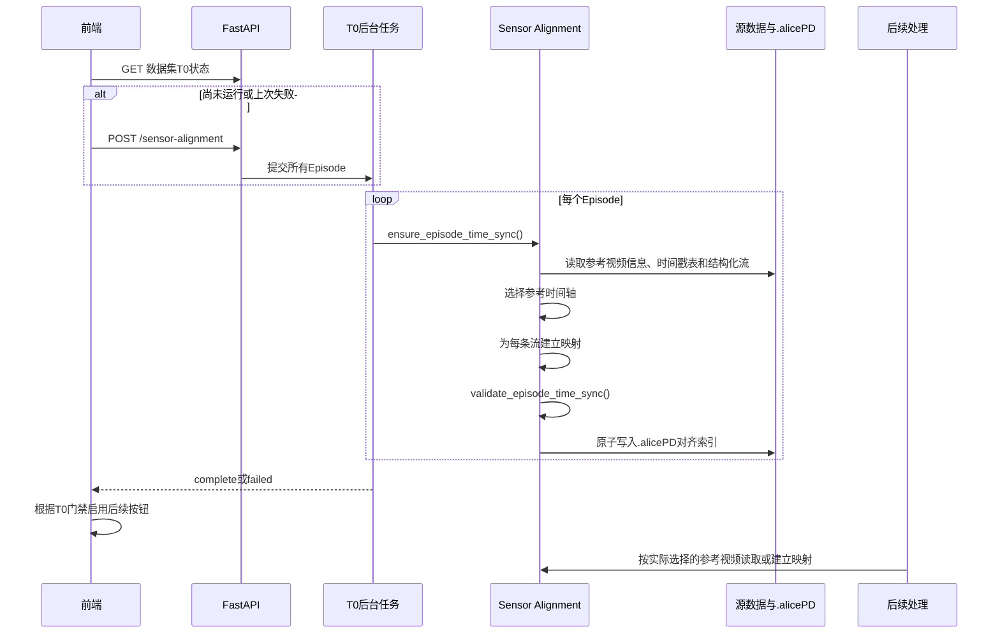

# Alice Blue 技术文档（02）：T0 多传感器时间同步

> 文档状态：依据当前工程实现与可复现夹具审查编写
> 本章输入：数据集载入阶段生成的 `manifest`、Episode、媒体流和结构化文件索引
> 本章输出：每个 Episode、每条参考视频对应的传感器行映射，以及后续处理的 T0 门禁状态
> 不在本章展开：Joint 格式转换、C1-C3 质量判定、行为语义识别和导出字段定义

## 1. T0 解决什么问题

一个视频帧和一个传感器数组行并不天然表示同一时刻。常见情况包括：

- 头部 RGB 为 50 Hz，腕部 RGB 为 60 Hz；
- Mocap 原始流为 60 Hz，同步流为 30 Hz；
- 触觉原始流和同步流同时存在；
- 视频时间戳按相机分别记录；
- 某些同步行是 `partial` 或插补行；
- 文件只有帧数和采样率，没有共同时间戳；
- 同一个 Episode 可以选择不同视频作为分析参考。

T0 的职责不是把源数据全部重采样成一个新文件，而是建立只读映射：

```text
参考视频帧号
→ 参考视频时间
→ 传感器时间或采样率
→ 传感器行号（或缺失 -1）
```

后续清洗、Joint 叠加、行为边界细化、Action 映射和导出必须基于这份映射读取同一时刻的数据。

## 2. 总体流程



主要实现位于：

```text
app/sensor_alignment.py
├─ scan_episode_sensor_alignment()
├─ validate_episode_time_sync()
├─ ensure_episode_time_sync()
├─ map_video_frame_to_sensor()
└─ SensorAlignmentJobManager
```

## 3. 触发方式与前端门禁

`renderDataset()` 安装 manifest 后立即调用 `startSensorAlignment(dataset_id)`。前端先查询：

```http
GET /api/datasets/{dataset_id}/sensor-alignment
```

如果状态不是 `queued`、`running` 或 `complete`，再提交：

```http
POST /api/datasets/{dataset_id}/sensor-alignment
```

前端轮询通用任务接口，并展示：

- 完成的 Episode 数；
- 已映射流数；
- 时间戳映射数；
- 倍率映射数；
- 采样率冲突数。

只要数据集级任务处于 `queued`、`running`、`cancelling`、`idle` 或 `failed`，清洗、VLM、Action 和导出入口就会被锁定。任务只有在所有 Episode 都通过时才为 `complete`；任一 Episode 失败，整个数据集级 T0 为 `failed`。

## 4. Episode 与参考视频

### 4.1 默认参考视频

`_reference_video()` 默认选择 Episode 的 `primary_media_file_id`。若主流不存在，则回退到第一条视频流，最后才回退到 Episode 自身。

参考对象保存：

```json
{
  "file_id": "head-rgb-id",
  "stream_name": "head_rgb.mp4",
  "relative_path": "ep_0001/camera/head_rgb.mp4",
  "fps": 50.0,
  "frame_count": 2500,
  "duration": 50.0
}
```

这里优先使用 `source_frame_count`，避免载入阶段的逻辑裁剪把原生视频时间轴伪装成另一长度。

### 4.2 多参考视频缓存

同一个 Episode 可以分别以头部 RGB、左腕或右腕视频为参考。默认主视频产物为：

```text
indices/sensor-alignment/<episode-id>.alignment.alice
```

非主视频会得到独立文件：

```text
indices/sensor-alignment/<episode-id>--<media-file-id>.alignment.alice
```

因此，腕部 60 Hz 视频不会复用头部 50 Hz 视频的帧映射。清洗流程会携带用户实际选择的 `media_file_id` 再次获取对应 T0。

## 5. 参考视频时间轴来源

T0 按以下优先级建立参考视频每一帧的时间：

### 5.1 `video_timestamps.parquet`

优先查找包含 `frame_idx`，以及 `ts_wall` 或 `pts_us` 的视频时间戳表。

若存在 `camera` 列，会根据参考视频名称映射到：

- `head_rgb` → `head`；
- `wrist_left` → `wrist_left`；
- `wrist_right` → `wrist_right`。

解析时拒绝：

- 非整数帧号；
- 超出媒体帧数的帧号；
- 非有限时间戳；
- 重复或倒退帧号；
- 不单调时间戳。

### 5.2 `sync.parquet`

若视频时间戳表不可用，则尝试读取同步表中的相机帧号和相机时间。`filled=true`、`partial=true`、越界、倒序或不单调行不会成为合法映射。

当视频时间戳表和同步表同时存在时，同步表主要用于交叉验证，并允许一种严格受限的修复：如果同步表最后一行只有一个越界帧号，但其时间可由已知节奏推导，则只补一个尾部视频时间戳，不会把后续未知帧全部钳制到最后一行。

### 5.3 合成时间轴

如果没有可靠时间戳表，但参考视频具有有效 FPS 和帧数，则使用：

```text
reference_time[i] = i / video_fps
```

产物明确标记为 `synthetic_frame_rate`。这只是视频自身的相对时间轴，不代表采集设备之间已经共享绝对时钟。

## 6. 结构化流探测

当前 T0 可直接探测：

| 容器 | 帧数依据 | 时间戳依据 | 采样率依据 |
|---|---|---|---|
| HDF5 | 数据集第一维的代表长度 | `timestamps`、`*_ts` 等数组 | 文件/数据集属性与采集元数据 |
| Parquet | 行数 | 时间戳列 | Arrow Schema Metadata |
| JSON | 顶层数组代表长度 | 时间戳数组 | 递归查找 Hz/FPS 字段 |
| JSONL | 有效行数 | 每行时间戳字段 | 首行元数据 |

时间戳数组最多读取 250,000 个值，JSON 最大检查 64 MiB。超过限制时不会无界加载。

探测结果包含：

- `data_count`；
- 候选采样率及证据；
- 时间戳质量；
- `master_clock` 声明；
- HDF5 `partial` 行有效性；
- 采样率声明是否冲突。

## 7. 映射模式

### 7.1 `prealigned_master_clock`

数据行数与视频帧数近似相等，并且存在主时钟声明或时间戳频率与视频 FPS 接近，同时没有长间隙、倒退或非有限值。

```text
sensor_index = video_frame_index
```

### 7.2 `paired_frame_index`

数据行数与视频帧数近似相等，但没有可用的对齐时间戳。系统将其视为采集器已经按帧配对：

```text
sensor_index = video_frame_index
```

这比时间戳对齐的证据弱，适合已经同步保存但不带逐行时间戳的流。

### 7.3 `timestamp_nearest`

参考视频和传感器都有时间戳时，为每个视频帧寻找最近的传感器行。

若匹配距离超过约 2.5 个传感器周期，或参考时刻落在超过 3 个周期的长间隙内部，则映射为 `-1`，不会跨间隙插值。

如果一边是 Unix/墙上时钟、另一边是相对设备时间，当前实现会分别减去首个有效时间作为相对起点，并记录 `origins_normalized=true`。如果两边都是同类时钟，则保留真实起始偏移。

### 7.4 `rate_multiplier`

没有可共同比较的时间戳，但存在可靠采样率时：

```text
index_multiplier = stored_hz / video_fps
sensor_index = round(video_frame_index * index_multiplier)
```

越出传感器范围的结果视为缺失。

## 8. Partial 与缺失数据

HDF5 中与数据行数一致的 `partial` 布尔数组会被保留。对应传感器行的映射改为 `-1`，同时记录：

- `partial_rows`；
- `partial_video_frames`；
- `partial_mapping_rejection_count`。

下游清洗读取 `frame_to_sensor_position` 或 `frame_to_sensor_index`。无效行产生 `NaN` 和 `valid=false`，不会用前一帧、零值或越界行替代。

这与 Nexus 触觉策略一致：数值为零不等于缺失；`partial`、空行或无映射才是数据质量问题。

## 9. T0 sidecar 产物

当前 Schema 为：

```text
alice/sensor-alignment/v4
```

核心结构如下：

```json
{
  "schema": "alice/sensor-alignment/v4",
  "dataset_id": "...",
  "episode_id": "...",
  "reference_media_file_id": "...",
  "reference_video": {},
  "reference_timestamp_source": {},
  "alignment_sources": [],
  "streams": [
    {
      "relative_path": "ep_0001/mocap/left.h5",
      "data_count": 3000,
      "physical_hz": 60.0,
      "stored_hz": 30.0,
      "index_multiplier": 1.0,
      "mode": "prealigned_master_clock",
      "frame_to_sensor_index": null,
      "lookup_quality": null,
      "rate_conflict": false
    }
  ],
  "skipped_files": [],
  "source_signature": {},
  "gate": {
    "status": "ready",
    "quality_status": "ready_with_repairs",
    "repaired_stream_count": 1,
    "warning_stream_count": 0
  }
}
```

写入采用同目录临时文件加原子替换，不改写源数据。

## 10. 缓存失效

正式扫描 T0 时会计算 `source_signature`，包含：

- 参考视频 ID、FPS、帧数和文件签名；
- Episode 内受支持结构化文件的相对路径、大小和纳秒修改时间。

`scan_episode_sensor_alignment()` 只有在 Schema 和签名都一致时才复用缓存，否则重新建立映射。

下游不再直接信任 `load_sensor_alignment()`；统一入口 `get_valid_sensor_alignment()` 会按参考媒体重新扫描、校验 Schema 和源签名，并执行 T0 门禁。

## 11. Nexus 与普通数据集的区别

### 11.1 Nexus

Nexus 的 T0 是必需步骤。载入阶段保留每条流的原生频率，T0 再结合：

- `video_timestamps.parquet`；
- `sync.parquet`；
- 同步/原始 HDF5；
- 采集元数据中的 `rate_hz`、`storage_fps`、`sync_fps`；
- `partial` 和 `filled` 标记。

头部和腕部视频分别拥有独立参考缓存。RGB-Depth 外参属于空间配准，不参与 T0 时间映射；T0 也不依赖 MANO、Nexus20 或 OpenXR 的关节拓扑。

### 11.2 EgoDex 和普通数据集

若 Joint 与视频逐帧存储，可使用 `prealigned_master_clock` 或 `paired_frame_index`。若存在真实时间戳则优先采用 `timestamp_nearest`；只有时间戳不足时才退回采样率倍率。

EgoDex 不需要 Nexus 相机外参，但仍需要确认视频帧和 Joint 行之间的时间对应关系。外参问题和时间同步问题必须分开处理。

### 11.3 格式模式边界

T0 读取载入阶段生成的 `processing_mode`，但不改变它。不同格式的空间处理必须保持独立：

| 模式 | T0 负责 | T0 不负责 |
|---|---|---|
| EgoDex | 视频帧与 EgoDex HDF5 行的时间对应 | 不引入 Nexus 外参；不把时间对齐误写成空间标定 |
| Nexus | RGB、Mocap、IMU、触觉和同步表的时间映射 | 不因 Nexus20 已转换为 MANO21 就直接宣称可投影到 RGB |
| OpenXR | OpenXR 手流与参考视频的时间映射 | 不把 OpenXR baseSpace 当作相机坐标系 |
| LeRobot / Alice Full | 读取声明的时间戳、帧号或采样率 | 不套用 EgoDex 或 Nexus 的空间转换规则 |

因此，T0 的 `gate.status=ready` 只表示时间轴可用；它不等于 `hand_projection_ready`。后续 C3、关节叠加和投影修正必须再次检查格式模式契约。

## 12. 下游怎样使用 T0

当前下游并没有统一遵守同一个 T0 合约。实际代码路径如下：

| 下游 | 当前入口 | 是否校验门禁 | 已确认的旁路 |
|---|---|---:|---|
| 数据清洗 | `_curation_time_sync()` | 是 | 无 T0 流输出全 NaN/无效帧；已验证的 partial mapping 保留为坏帧候选 |
| Joint 叠加 | `map_video_frame_to_sensor()` | 是 | 无映射返回 `alignment_valid=false` 和空 geometry；仅派生投影快照允许明确的逐视频帧 identity |
| 行为边界细化 | `get_valid_sensor_alignment()` | 是 | 只使用已通过 T0 门禁的 Joint bundle；失败时按可选修边界输入处理 |
| Action 后台任务 | `ensure_episode_time_sync()` + `_aligned_rows()` | 是 | 选中媒体 ID 贯穿 T0、取行和产物 FPS；不得由等长条件绕过 |
| C3 整手可见性 | Full Export `_aligned_rows()` | 是 | 通过字段和源行数精确选择 T0 stream |
| Full 导出 | `aligned_sensor_rows()` | 是 | 统一使用已验证映射，并传递选中媒体 ID |
| 投影归正 | `aligned_sensor_rows()` | 是 | 原始动态流必须有 T0；派生逐视频帧 sidecar 单独标记 |
| Episode T0 查询接口 | `load_sensor_alignment() or scan...` | 否 | 可把源文件变化前的旧缓存返回给前端 |

因此，当前“某个任务开始前调用过 `ensure_episode_time_sync()`”并不能证明该任务后续一定使用了刚验证的同一份映射。调用方可能随后重新直接加载缓存、忽略参考媒体 ID，或者在等长条件下自行建立 identity 映射。

清洗流程还能处理 S1 插入的中间帧。它使用 `source_frame_positions` 对原始传感器映射做分数位置插值，并生成 `frame_to_sensor_position`，但不会回写基础 T0 文件。

## 13. 不足总表

本轮审查使用临时小型夹具逐项复现；以下历史问题已在实现中收口，保留在表中作为审计记录。

| 严重度 | 不足 | 实证结果 | 直接影响 |
|---|---|---|---|
| P0 | CSV/TSV/NPY/NPZ 不进入 T0 | 已修复：扩展名纳入扫描并生成字段 stream | 关键流进入统一同步与签名失效链 |
| P0 | 门禁不检查关键流覆盖率 | 已修复：0% 覆盖阻断，部分覆盖标记 warning | 整段无同步数据不会解锁后续流程 |
| P0 | T0 以文件而不是字段建模 | 已修复：HDF5 按字段/成员和源行数建模 | 多频率容器不再共用错误时间轴 |
| P0 | 等长即同步的假设过强 | 已修复：有时间戳优先做 timestamp mapping，并记录起点修复 | 等频 offset 不再静默 identity |
| P0 | 下游缺流时仍自行补映射 | 已修复：清洗输出 NaN，Joint 叠加返回无效 geometry | 未知关系不会被伪装成有效同步 |
| P1 | 直接加载缓存不校验源签名 | 已修复：下游统一使用 `get_valid_sensor_alignment()` | 源文件变化会触发重建和门禁 |
| P1 | 参考媒体 ID 没有贯穿导出链 | 已修复：Full/C3/投影/Action 传递媒体 ID | 腕部视频不会误读取头部视频映射 |
| P1 | 采样率冲突不参与门禁 | 同一文件声明 30 Hz 与 100 Hz，`rate_conflict=true` 但仍 `ready` | 倍率映射可选中错误 Hz |
| P1 | 时间单位与时钟起点可被自动“修正” | 无单位的 10 tick 被推断为 ms；绝对/相对时钟首样本自动对齐后 30/30 帧有效 | 真实延迟和错误单位可能被掩盖 |
| P1 | Episode 文件归属逻辑不统一 | 已修复：Joint Overlay 纳入 `file_episode_assignments` | 重归属文件可见性与 T0 一致 |
| P2 | UI 的“已同步”语义过强 | 已修复：显示自动修复路数和部分覆盖路数 | 用户可区分 ready 与 ready_with_repairs |
| P2 | 质量指标不足 | 已修复：sidecar 保留覆盖率、P95/最大匹配误差和 repair 证据 | `ready` 的质量可审计 |

## 14. P0：会造成静默错帧的正确性问题

### P0：关键 CSV/NumPy 流可以绕过 T0

下游数值读取支持：

```text
HDF5, Parquet, NPY, NPZ, JSON, JSONL, CSV, TSV
```

但当前 T0 的 `SENSOR_EXTENSIONS` 只包含：

```text
HDF5, Parquet, JSON, JSONL
```

已用临时夹具复现：Episode 含一个被标为 `canonical_kind=joint` 的 `joint.csv`，T0 返回：

```json
{
  "gate": {"status": "ready"},
  "stream_count": 0,
  "skipped_files": []
}
```

即关键 Joint 没有进入映射，也没有进入阻断清单。

而且 `_episode_signature()` 也只收集 `SENSOR_EXTENSIONS`，所以这些文件不仅不参与映射，后续修改它们也不会使 T0 缓存失效。

更危险的是，清洗下游仍能读取这些容器。当 `_alignment_stream()` 返回 `None` 时，`_resample_to_video()` 当前使用：

```text
linspace(0, source_count - 1, video_frame_count)
```

进行全长均匀铺设。已复现 3 行 Joint 对 6 帧视频时产生：

```json
{
  "source_rows": [0, 0, 1, 1, 2, 2],
  "valid": [true, true, true, true, true, true]
}
```

这不是可证明的同步关系，但所有帧都被标为有效。

建议：

1. 让 T0 与下游共用同一个 `NUMERIC_EXTENSIONS` 定义；
2. 为 CSV/TSV、NPY/NPZ 增加有界帧数、时间戳和采样率探测；
3. 即使容器暂不支持，也必须把关键流写入 `skipped_files`，由门禁阻止后续处理；
4. 测试所有下游可读容器与 T0 支持集合完全一致。

### P0：门禁不检查关键流的有效覆盖率

已用 HDF5 夹具复现：参考视频为 30 帧，Joint 时间戳与视频时间完全不重叠，最终：

```json
{
  "gate": {"status": "ready"},
  "mode": "timestamp_nearest",
  "lookup_count": 30,
  "valid_count": 0,
  "invalid_frame_count": 30
}
```

当前门禁只阻止关键文件缺失、检查失败或没有时间序列，不阻止“映射存在但全部无效”。

建议为每条关键流计算：

```text
mapped_count
valid_coverage = mapped_count / reference_frame_count
maximum_match_error
p95_match_error
long_gap_coverage
```

门禁策略建议区分：

- Joint/Action：覆盖率不足直接 `blocked`；
- Nexus 同步触觉/压力：缺行或 partial 按现有质量策略直接阻断或判为坏帧；
- 可选辅助传感器：允许 `warning`，但不得显示为完全同步；
- 纯视觉 Episode：允许零传感器流的 `ready`，并明确写 `vision_only`。

具体阈值应从真实 Nexus 数据统计后确定，不应在没有样本分布时随意写死。

### P0：同一容器中的不同字段被错误共用一条时间轴

当前 T0 的 stream 主键只有 `relative_path`，不包含字段路径；`_probe_hdf5()` 会扫描文件内所有数组，再从所有第一维长度中选一个“代表行数”。字段自己的 rate 属性也被汇总到文件级候选列表，关联关系被丢失。

临时 HDF5 夹具包含：

```text
joint:      [30, 3]
tactile:    [100, 8]
timestamps: [100]，100 Hz
参考视频:   30 帧，30 Hz
```

T0 只产生一条 `mixed.h5` stream，并把 `data_count` 设为 100。清洗读取 `joint` 字段时，仍套用这条 100 行映射。实测结果：

```json
{
  "gate": "ready",
  "t0_stream_count": 1,
  "t0_data_count": 100,
  "joint_source_count": 30,
  "valid_joint_video_frames": 9,
  "invalid_joint_video_frames": 21
}
```

这说明 T0 的数据模型必须从“文件级 stream”升级为“文件 + 字段/字段组级 stream”。对于 HDF5、NPZ、Parquet 等可容纳多张表或多列时间轴的容器，仅扩展文件后缀仍不够。

建议 stream ID 至少包含：

```text
relative_path
field 或 field_group
data_count
timestamp_field
rate evidence
semantic kind
```

下游也必须按 `relative_path + field` 查映射，不能只按文件名匹配。

### P0：帧数相等不能证明时间同步

核心 T0 与多个下游都存在过强的 identity 假设。

核心 `_build_stream()` 当前在以下条件下选择 `prealigned_master_clock`：

```text
数据行数近似等于视频帧数
并且时间戳频率接近视频 FPS 或存在 master_clock 声明
并且没有长间隙/倒退
```

它没有比较两条时间轴的起始 offset。已复现视频为 0–10 秒、Joint 为 0.5–10.5 秒，两边均为 300 行/30 Hz，结果仍为：

```json
{
  "gate": "ready",
  "mode": "prealigned_master_clock",
  "mapping_rule": "sensor_index = video_frame_index",
  "sensor_timestamp_start": 0.5
}
```

另外，无时间戳、无采样率、只有 299 行数据对 300 帧视频时，也会因 1% 行数容差进入 `paired_frame_index` 并返回 `ready`。

下游的假设更强：

```python
if source_count == video_count:
    return np.arange(video_count)
```

该逻辑存在于 Full Export 和投影归正；C3 整手可见性与 Action 映射又复用了 Full Export 的实现。夹具通过把 T0 加载函数设为“只要调用就报错”，确认等长分支仍能成功返回 `[0, 1, 2, ...]`，即这些路径完全没有读取 T0。

当前实现已取消所有下游的独立等长快捷路径。identity 只能由 T0 在验证共同时间戳、明确 recorder 帧配对声明，或经人工确认后产生。

### P0：找不到 T0 映射时不应构造“看起来有效”的映射

历史实现存在以下危险兜底（现已移除）：

1. 清洗 `_resample_to_video()`：无 alignment stream 时按全长线性铺设；
2. Joint Overlay：`map_video_frame_to_sensor()` 抛出 `KeyError` 时使用当前视频帧号作为传感器行号；

Joint Overlay 已用夹具复现：请求视频第 7 帧、T0 没有该源流，结果仍返回：

历史夹具曾得到：

```json
{
  "alignment_mode": "unmapped",
  "alignment_valid": false,
  "sensor_index": null,
  "joint_count": 0
}
```

当前实现改为 `alignment_mode="unmapped"`、`alignment_valid=false`、`sensor_index=null` 和空 `points`。

安全规则应该是：关键动态流没有经过 T0 时，返回 `alignment_valid=false` 并停止使用该流。需要兼容历史逐帧数据时，应生成带来源证据和确认状态的正式 T0 stream，而不是由每个下游自行猜测。

## 15. P1：缓存、媒体选择与证据可信度问题

### P1：直接加载缓存时未校验源签名（已修复）

`scan_episode_sensor_alignment()` 会校验签名；下游统一入口 `get_valid_sensor_alignment()` 会在需要时重建并执行门禁。

建议提供统一入口：

```text
get_valid_sensor_alignment(...)
```

它必须验证 Schema、参考媒体 ID 和源签名；所有下游禁止直接信任未验证缓存。

现在的统一入口会先按源签名检查缓存，再执行 `validate_episode_time_sync()`；源文件变化或门禁失败都会阻止下游继续。

### P1：选中媒体 ID 没有贯穿所有消费端（已修复）

清洗流程会按用户选择的 `media_file_id` 建立独立 T0。Full Export、C3、投影归正和 Action 现在都把同一个 `reference_media_file_id` 传入取行和产物校验：

```python
aligned_sensor_rows(..., reference_media_file_id=selected_media_file_id)
```

因此“所选视频、清洗报告、行为结果、T0 文档和导出时间轴”共享同一个参考媒体 ID；Action 产物还写入参考 FPS 和媒体 ID，验证时会检查它们。

### P1：采样率冲突只警告，不参与门禁

当前多个 Hz 候选不一致时保留 `rate_conflict=true`，但仍选择第一个直接候选并允许 `ready`。

建议建立证据优先级：

```text
逐行共同时间戳
> recorder同步声明
> 文件内直接属性
> 数据长度/时长推导
> 文件名或默认值
```

只有映射不依赖冲突 Hz 时才允许继续；纯倍率映射若 Hz 冲突，应要求人工确认或阻断关键流。

当前实现仍保留冲突候选用于审计，但若关键流的有效映射依赖冲突倍率，后续应将其升级为人工确认门禁。已有 `rate_conflict`、覆盖率和误差证据会写入 sidecar，不再静默丢弃。

历史夹具中同一 HDF5 同时声明 `sample_rate=30` 和数据集属性 `rate_hz=100`，旧实现结果为：

```json
{
  "gate": "ready",
  "mode": "rate_multiplier",
  "selected_physical_hz": 30.0,
  "rate_conflict": true
}
```

此时映射恰恰依赖冲突 Hz，却仍然放行。

### P1：时间单位和起点归一化需要置信度

无单位时间戳当前会根据数值量级和“接近参考 FPS”推断秒、毫秒、微秒或纳秒。当绝对时钟与相对时钟混用时，会自动对齐两边首个有效值。

已复现两个边界情况：

- 名为 `timestamp` 的序列每次增加 10，面对 30 FPS 参考视频时被推断为 `ms`，得到 100 Hz；若真实单位是秒，这会把 290 秒压缩成 0.29 秒；
- 一侧为 Unix 时间，另一侧从 50 秒开始，系统自动各减首值后得到 30/30 帧有效的 identity 对应，原始 offset 不再参与门禁。

建议在产物中增加：

- `timestamp_unit_confidence`；
- `origin_alignment_mode`；
- `origin_offset_seconds`；
- `requires_manual_confirmation`。

对于关键流，低置信度单位或自动首帧对齐不应与真实共同时间戳显示成同一可信等级。

### P1：Episode 归属与流身份需要统一（主要路径已修复）

T0、清洗、Full Export、投影归正和 Joint Overlay 统一读取 `episode_resolution.file_episode_assignments`。Episode 文件成员关系仍应继续收敛到公共函数，避免未来模块再次复制筛选逻辑。

### P1：行为边界细化只扫描、不验证（已修复）

`load_episode_joint_pose()` 现在调用 `get_valid_sensor_alignment()` 后再读取 Joint bundle；异常时仍按可选增强返回 `None`，但不再使用未验证的 Joint。

## 16. P2：可观测性和状态语义不足

### P2：数据集级完成状态只代表主视频

初始后台任务只为每个 Episode 的主视频建立 T0。腕部等其他视频仍需在后续任务中按需扫描；前端状态会显示自动修复路数、部分覆盖路数和频率冲突，而不是只显示“已同步”。

操作按钮仍依赖后台任务状态；具体 Episode/媒体的执行门禁由 `get_valid_sensor_alignment()` 再次确认。

### P2：当前 lookup quality 不能回答实际误差

`_nearest_timestamp_lookup()` 现在记录的 `max_match_distance_seconds` 实际是允许的最大距离阈值，不是本次映射观察到的最大误差。当前产物还缺少：

```text
valid_count / invalid_count / valid_coverage
actual_max_error_seconds
p50 / p95 / p99_error_seconds
start_offset_seconds / end_offset_seconds
clock_drift_ppm
long_gap_coverage
timestamp_unit_confidence
alignment_evidence_level
```

没有这些指标，就无法区分“30 帧全部精确匹配”和“30 帧都勉强落在容许阈值内”。

## 17. 推荐实施顺序

```text
1. 建立字段级 StreamKey：relative_path + field/field_group
2. 统一结构化容器支持集合，并移除“无映射时线性铺满/identity”兜底
3. 删除所有下游等长快捷路径，统一通过一个 get_valid_sensor_alignment() 入口
4. 建立关键流清单、必需/辅助等级及有效覆盖率门禁
5. 让 reference_media_file_id / timeline_id 贯穿清洗、C3、Action、归正和导出
6. 给时间单位、时钟起点和采样率证据增加置信等级与人工确认
7. 统一 Episode 文件归属函数与缓存签名校验
8. 增加实际误差、漂移、长间隙和每媒体状态展示
9. 最后使用真实 Nexus 数据标定阈值
```

第一至第五项是正确性修复，应在继续扩大数据格式适配前完成。第六至第八项提升证据可信度和可审计性。第九项需要实际数据统计，不能只依赖单元夹具。

## 18. 建议的统一调用契约

建议所有动态流消费端只允许调用一个入口：

```text
get_valid_sensor_alignment(
    manifest,
    episode,
    reference_media_file_id,
    required_streams=[StreamKey(...)],
    minimum_coverage=...,
)
```

返回结果必须同时满足：

1. Schema 版本匹配；
2. Episode 与参考媒体匹配；
3. 源签名仍有效；
4. 已执行门禁；
5. 所有必需字段级 stream 均存在；
6. 覆盖率和误差满足该流的质量策略；
7. 每个映射明确标记证据等级；
8. 调用方不能在失败后自行构造行号或线性映射。

纯视觉 Episode、静态标定文件和可选辅助传感器应显式声明类型，不应通过“找不到流也继续”来兼容。

## 19. 代码导航

| 责任 | 文件与入口 |
|---|---|
| T0 核心探测、映射、缓存和门禁 | `app/sensor_alignment.py` |
| T0 API 和通用任务查询 | `app/main.py` |
| 前端自动启动、状态和操作门禁 | `static/app.js::startSensorAlignment()` |
| 清洗重采样与 S1 插帧重映射 | `app/curation_pipeline.py::_curation_time_sync()`、`_resample_to_video()` |
| Joint 画面映射 | `app/joint_overlay.py::joint_overlay_geometry()` |
| MANO/Joint 导出映射 | `app/full_export.py::_aligned_rows()` |
| 投影归正映射 | `app/projection_correction.py::_aligned_rows()` |
| 行为边界 Joint 读取 | `app/behavior_boundary_refiner.py::load_episode_joint_pose()` |
| T0 回归测试 | `tests/test_sensor_alignment.py` |

## 20. 本章结论与下一章接口

当前 T0 已具备较完整的时间轴基础：多参考视频缓存、视频时间戳优先、字段级 stream、CSV/TSV/NPY/NPZ 扫描、partial 保留、长间隙拒绝、相对时钟起点修复、倍率回退、覆盖率门禁和数据集级失败门禁都已实现。它不是简单的 `frame * Hz`。

当前仍需重点关注的是：**文件被识别，不等于其中每个字段共享同一时间轴；帧数相等，也不等于时间相同。** 下游统一入口和字段绑定已经消除了此前的静默猜测路径。

`ready` 表示关键动态流存在可验证映射；`ready_with_repairs` 还表示存在自动修复或部分覆盖 warning。二者都保留覆盖率、匹配误差和修复证据，供 C3、清洗和导出审计。

完成这些改进后，下一步先进入 **视频平滑与时序稳像**：在已经验证的参考视频时间轴上生成不改帧序、不改逻辑帧数的 RGB 派生视频，再执行 S1-S5/C3 逐帧质量判定。视频平滑完成后，才进入 **关节流规范化与 MANO21 适配层**，分别说明 EgoDex、Nexus20 和 OpenXR26 如何在保持原始坐标语义的前提下形成统一的 21 点运动学表示；随后再单独讨论各模式的相机投影与 C3 能力，不把稳像、MANO21 点序转换和空间外参混为一个步骤。
