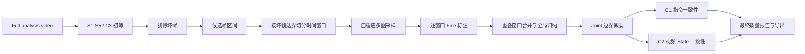

# 05 VLM 三级行为标注

## 1. 本章范围

本章说明数据质量初筛之后，系统如何使用 Qwen-VLM 对 Episode 生成粗粒度任务、中层子任务和细粒度动作标注，以及这些标注如何与 Joint 运动、C1/C2、人工去除和 Full 导出衔接。

当前实现的主要代码入口为：

    app/behavior_annotator.py
    app/behavior_prompt.py
    app/behavior_boundary_refiner.py
    app/models.py::ModelRegistry.annotate_behavior()

当前产物版本为：

    Behavior schema: alice/vlm-behavior/v1
    Behavior artifact version: 5
    Annotation protocol version: v4
    Annotation protocol schema: tri_level_v1

这里的“VLM 标注”专指行为语义和时序分段。独立的 Qwen 有效/无效窗口剪切属于另一条流程，不在本章混用。

## 2. 在完整管道中的位置

VLM 位于 S1-S5/C3 初筛之后、C1/C2 之前：

VLM 不负责重新判断黑帧、模糊、手部可见性或数值突变。坏帧不会送入 Qwen；待复核帧和有效帧都属于可标注候选帧。

## 3. 运行入口

### 3.1 独立行为标注

界面的“VLM 行为标注”通过 batch analysis 作业提交一个或多个 Episode。每个 Episode 必须明确绑定符合以下条件的 RGB 流：

- modality=rgb；
- vlm_eligible=true；
- 媒体可以实际解码；
- 多视频 Episode 使用明确的 media_file_id。

独立模式默认将 sample_count 解释为“每个时间窗口的图片上限”，默认 56，接口允许 6–64。该值不再是整个 Episode 的图片总数。

### 3.2 数据质量清洗和 Full

清洗或 Full 先生成 pre_vlm_segments，再调用 curation_vlm_ranges()：

- state=invalid 的坏帧区间被排除；
- state=uncertain 的待复核区间保留；
- state=valid 的有效区间保留；
- 相邻候选区间合并为 allowed_ranges。

Full 使用平滑后的 analysis video 和冻结的 timeline_id。标注产物必须与同一个 full_run_id、timeline_id 和 media_file_id 绑定，不能把另一次运行的 VLM 结果拼接进当前 Full bundle。

## 4. 分析媒体选择

behavior_analysis_context() 按以下顺序确定实际用于标注的视频：

1. 用户指定的源 RGB 视频；
2. 如果存在已应用的视频平滑结果，优先使用平滑视频；
3. 如果存在已应用的投影归正视频，则使用归正视频；
4. 如果存在与当前分析帧数一致的清洗报告，则附加 allowed_ranges，只在未判为坏帧的范围中抽样。

source_video 和 analysis_video 分开记录。源视频用于确认用户选择和源身份，analysis_video 是 Qwen 实际看到的帧空间。

进入抽帧前，系统调用 T0 时间同步，确保后续 Joint 边界微调能够映射到同一分析时间轴。

## 5. 关键帧抽样

### 5.1 分窗

系统不会上传完整视频，而是严格以 allowed_ranges 为边界切分时间窗口。默认窗口约 20 秒、重叠约 3 秒；窗口不会跨越坏帧区间。若某个范围只比窗口略长，允许在重叠预算内适当扩展单窗，避免生成内容几乎重复的窗口。

### 5.2 自适应多图采样

每个窗口独立获得图片预算，默认最多 56 张，并同时使用四类证据：

- 约 1.5 FPS 的基础均匀时序图；
- 已对齐 Joint Pose 的运动变化峰值；
- 清洗报告中综合 Joint、Action、触觉等信号得到的 motion 分数；
- 基础时序图之间的画面差分峰值。

事件附近按约 12 FPS、前后约 0.75 秒补充图片。每窗基础图原则上不少于 12 张；很短的有效区间至少保留 6 张，区间本身不足 6 帧时读取全部帧。窗口首尾始终属于基础采样。

每张图仍保存准确的 analysis frame index、时间戳和抽样序号映射。产物同时记录每个窗口的基础帧数、事件补图数以及 Joint、质量运动和画面差分触发帧。

## 6. 发送给 Qwen 的内容

系统对每个窗口分别发送一次多图请求：

- system prompt；
- user prompt；
- 每张关键帧前的 SAMPLED_FRAME、ORIGINAL_FRAME 和 TIME 文本；
- 对应 JPEG 图像；
- Episode 名称；
- 最多约 3,500 字符的数据结构理解摘要；
- analysis video 总帧数和总时长；
- 当前窗口的绝对起止帧和窗口编号；
- 实际加载的行为 ontology。

窗口超过一个时，系统再发送一次不含图片的结构化汇总请求，根据各窗口 Fine 结果生成全局 Coarse 和多个 Medium 子任务。汇总请求失败时保留窗口 Fine 结果，并使用确定性规则生成回退结果和 warning。

模型请求使用：

    temperature = 0.0
    enable_thinking = false
    response_format = json_object
    max_tokens = 8000

默认超时为 300 秒，可通过 VLA_QWEN_TIMEOUT 调整。第一次返回无法解析为 JSON 时，系统追加“仅返回严格 JSON”的指令并重试一次；第二次仍失败则整个 Episode 标注失败。

## 7. 三级标注协议

### 7.1 Coarse：粗粒度任务

Coarse 只保存一个 summary，用短语描述整个 Episode 的任务目标，例如：

    整理书架
    零件装配
    桌面物品分拣

当前代码直接把 coarse.summary 同时作为：

- task_label；
- behavior_description；
- coarse.summary。

### 7.2 Medium：中层子任务

Medium 表示多个具有独立目的的中层子任务。提示词要求在操作目标切换时分段，通常建议 3–8 段，每段描述：

    哪只臂或双臂
    做了什么
    操作什么物体
    从哪里到哪里

系统按 start_frame 排序，并重新计算相邻分界，使所有 Medium 段连续覆盖完整 analysis timeline，不允许重叠或空隙。

### 7.3 Fine：细粒度动作

Fine 使用固定 meta_action 词表。v4 新增 Idle、Observe、Reach、Withdraw、Align 和 Inspect。每段包含：

- start_frame；
- end_frame；
- description；
- skill；
- skill_zh；
- confidence；
- object_nouns；
- primary_targets；
- target_instance；
- evidence_frames。

v4 不再要求每个 Fine 至少 5 秒。短暂但真实的 Reach、Touch、Release 和 Withdraw 必须保留。

Fine 同时转换为 segments。segments 是界面时间轴、C2、动作去除和导出实际使用的行为分段。

## 8. 输出规范化

Qwen 的输出不能直接写入产物，后端会执行以下规范化：

1. 非法 skill 统一转换为 Other；
2. skill 映射为内部 phase_label；
3. 越界帧号裁剪到 analysis timeline；
4. 相邻同 phase、同 skill、同目标实例的片段可以合并；
5. Qwen 未覆盖的范围显式补为 unknown；
6. 根据相邻边界中点重新建立连续、无重叠的完整分段；
7. 生成 start_time 和 end_time；
8. Fine 与 segments 的帧区间必须完全一致。

v4 读取模型返回的逐段 confidence；缺失时使用 0.5 的保守默认值。总体 confidence 按非 unknown 片段持续帧数加权计算，不再固定为 0.8。

如果收到旧版 task_label/segments 格式，系统仍保留兼容转换路径，将旧结果补成 coarse、medium 和 fine。

## 9. Joint 边界微调

Qwen 决定动作语义和初始分段，Joint 只允许调整相邻 Fine 片段的分界位置，不允许修改动作标签。

处理过程为：

    已对齐 Joint Pose
    → 帧间差分
    → 按各维度 robust scale 归一化
    → 计算综合运动强度
    → 0.1 秒移动平均
    → 比较边界前后约 0.15 秒运动强度变化
    → 在 VLM 边界 ±0.5 秒内搜索显著峰值

只有候选峰值超过全局 median + MAD 证据下限时才移动边界。调整后仍保证：

- 分段顺序不变；
- 每段至少一帧；
- 相邻片段无空隙、无重叠；
- 第一个开始帧和最后一个结束帧不变。

boundary_source 保存为：

- vlm：保留 Qwen 边界；
- joint_refined：使用 Joint 运动调整；
- curation_precheck：该范围在 VLM 前已被质量初筛排除。

当前只微调 Fine/segments 边界，Medium 边界不会随 Joint 运动再次求解。

## 10. 与坏帧范围的重新合并

每个 Qwen 请求只允许描述自己的窗口，窗口本身不会跨越 allowed_ranges 的间隙。重叠窗口按逐帧置信度和距离窗口中心的可靠度合并。Joint 微调也按每个 allowed_range 分开执行，之后再恢复完整时间轴：

- allowed_ranges 内保留行为语义；
- 坏帧区间写为 unknown；
- unknown 的 boundary_source 为 curation_precheck；
- 最终 segments 仍完整覆盖全 Episode。

因此模型不会再把两个不连续有效区间当作同一段连续视觉上下文。

## 11. 产物和复用

独立标注写入：

    <dataset>/.alicePD/behavior-annotations/<episode>.behavior.alice
    <dataset>/.alicePD/behavior-targets/<episode>.targets.alice

Full run 写入当前 run 的 behavior 阶段目录。behavior 产物保存：

- provider 和模型信息；
- language_source；
- sampling 和 allowed_ranges；
- source_video 和 analysis_video；
- timeline；
- coarse、medium、fine 和 segments；
- boundary_refinement；
- task_label、目标物体和警告；
- full_run_id、timeline_id。

只有以下条件全部满足时才复用已有结果：

- schema、artifact version 和 v4 协议一致；
- segments 连续覆盖当前帧空间；
- coarse、medium、fine 结构有效；
- dataset_id 和 episode_id 一致；
- 所选源媒体一致；
- 源视频 fingerprint 一致；
- 平滑分析视频存在且 fingerprint 一致；
- analysis frame count 一致；
- allowed_ranges 与当前清洗结果完全一致。

Full 复用时会把验证通过的标注复制到当前 run 目录，并写入当前 timeline_id，不直接引用可变的全局 sidecar 文件。

## 12. 界面和人工操作

右侧 VLM 行为标注面板当前显示：

- Coarse 高层任务；
- behavior_description；
- 总体 confidence；
- 目标物体词；
- Medium 中层子任务；
- Fine 动作卡片；
- 每段开始/结束时间；
- boundary_source；
- 行为时间轴。

点击 Medium 或 Fine 项会跳转到对应视频帧。

当前人工操作主要是“按动作去除”：用户选择一个 phase_label 后，系统把所有同类片段写入人工 annotation 侧车，状态改为 invalid。它不会改写原始 VLM behavior 文件，也不支持直接修改任务名称、动作标签、目标物体或单个边界。

## 13. 下游使用

### 13.1 C1

C1 把 task_label 与 Episode 的 name、task、instruction 和 description 做词集合比较。任务标签模糊、词集合完全不相交或 confidence<0.35 时，把候选帧标为待复核。

### 13.2 C2

C2 对 Fine/segments 中预期存在主动操作的阶段检查 Joint/Action 运动证据。主动阶段缺少运动时，对应片段进入待复核；C2 不清除前序阶段已经产生的待复核状态。

### 13.3 Full 导出

Full 导出使用行为标注完成：

- task/category 分类；
- phase_label 写入；
- Medium/Fine JSON 输出；
- 标准裁剪模式删除 idle、默认保留 reach；
- 目标物体和实例字段写入；
- Episode LeRobot + JSON 模式中的中层子任务描述。

behavior-targets 文件还会向 YOLOE 无动作剪切提供目标物体词。

## 14. 当前实现的主要不足

### 14.1 规范化仍可能掩盖模型遗漏

后端会自动补 unknown、移动边界并强制所有分段连续。这能保证数据结构可用，但也可能把缺失区间、重叠区间或严重错误的响应“修成合法 JSON”，而没有触发第二次语义纠错请求或质量阻断。

### 14.2 Medium 与 Fine 缺少层级一致性校验

Medium 和 Fine 分别被归一化为完整时间轴，但系统没有验证 Fine 动作是否合理隶属于对应 Medium 子任务，也没有使用 Joint 细化 Medium 边界。

### 14.3 人工复核能力有限

界面可以查看分段并按 phase 批量去除，但不能直接：

- 修改 Coarse 任务名称；
- 编辑 Medium 子任务描述和边界；
- 修改单个 Fine skill；
- 调整单个动作边界；
- 补充目标物体和目标实例；
- 确认或驳回 Joint 边界微调。

### 14.4 请求期间取消不够及时

后台作业可以取消，但 Qwen HTTP 请求本身是同步阻塞调用。用户取消后通常要等当前 API 请求返回或超时，作业线程才能真正结束。

### 14.5 多窗口请求成本

图片数量现在随 Episode 时长增长。长 Episode 的视觉覆盖显著改善，但请求次数、传输量和推理费用也相应增加。后续可增加窗口级缓存、并发上限和失败窗口单独重试。

### 14.6 图像序列的源身份保护较弱

单视频文件使用大小、修改时间和摘要 fingerprint。图像序列没有单一视频文件时仍依赖旧式媒体描述检查，保护强度低于文件视频；行为与目标两个 JSON 也分别原子写入，不是一个跨文件事务。

## 15. 代码与测试导航

| 责任 | 文件或入口 |
|---|---|
| 请求参数 | app/schemas.py::BehaviorAnnotationRequest、BatchAnalysisRequest |
| 作业入口 | app/batch_jobs.py、app/behavior_annotator.py::BehaviorJobManager |
| 媒体与范围选择 | app/behavior_annotator.py::behavior_analysis_context() |
| 分窗规划 | app/behavior_annotator.py::_plan_behavior_windows() |
| 自适应多图采样 | app/behavior_annotator.py::_adaptive_window_indices() |
| 重叠窗口合并 | app/behavior_annotator.py::_merge_window_segments() |
| 提示词和 meta_action | app/behavior_prompt.py |
| Qwen 窗口请求与全局汇总 | app/models.py::ModelRegistry.annotate_behavior()、summarize_behavior_windows() |
| 输出规范化 | app/behavior_annotator.py::_validate_result() |
| Joint 边界微调 | app/behavior_boundary_refiner.py |
| 复用和持久化 | app/behavior_annotator.py::behavior_annotation_status() |
| C1/C2 | app/curation_pipeline.py |
| 人工按动作去除 | app/annotation_edits.py::apply_behavior_phase_exclusion() |
| 界面显示 | static/app.js::renderBehaviorAnnotation() |
| Full 导出 | app/full_export.py |
| 三级协议测试 | tests/test_behavior_phase_protocol.py |
| 边界微调测试 | tests/test_behavior_boundary_refiner.py |
| 复用测试 | tests/test_behavior_annotation_reuse.py |
| 前端契约测试 | tests/test_frontend_behavior_inspector.py、tests/test_frontend_behavior_timeline_contract.py |

下一步应优先增加窗口级失败重试、Medium/Fine 层级一致性检查和人工逐段编辑能力。
