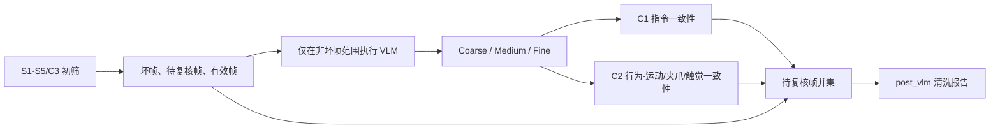

# 06 C1 与 C2 跨模态一致性复核

## 1. 本章范围

本章说明 VLM 行为标注完成后，系统如何执行：

- C1：Episode 指令与 VLM 任务语义一致性检查；
- C2：VLM 动作阶段与 Joint/Action、夹爪、Nexus 触觉证据一致性检查；
- 将 C1/C2 新增的待复核帧与 S1-S5/C3 结果合并；
- 生成 post_vlm 清洗报告。

主要代码入口为：

    app/curation_pipeline.py::inspect_instruction_consistency()
    app/curation_pipeline.py::inspect_behavior_state_consistency()
    app/curation_pipeline.py::load_nexus_tactile_evidence()
    app/curation_pipeline.py::resolve_post_vlm_review()
    app/curation_pipeline.py::finalize_episode_curation()

当前 Curation pipeline version 为 19。

## 2. 管道位置



C1 和 C2 都属于复核门控，不直接新增坏帧。它们只能把候选帧加入待复核状态，不能把 S1-S5/C3 已经产生的坏帧或待复核帧恢复为有效帧。

## 3. 输入和时间轴

finalize_episode_curation() 从 pre_vlm 清洗报告恢复：

- frame_count 和 fps；
- pre_vlm_segments；
- 坏帧 mask；
- 初筛待复核 mask；
- analysis video 对应的 T0 时间同步结果。

随后重新加载与当前 analysis video 对齐的 Joint、Action 和 Nexus 压力/触觉。若 analysis video 来自平滑或重采样，系统通过 source_frame_positions 重新映射传感器时间轴，并在读取后应用 S1 修复补丁。

C1/C2 使用的帧空间与 VLM v4 behavior 产物一致，均为 analysis_video 的绝对帧坐标。

## 4. C1：指令与任务标签一致性

### 4.1 当前输入

C1 从 behavior 中读取：

    task_label
    confidence

从 Episode 中拼接：

    name
    task
    instruction
    description

### 4.2 当前词元化

系统执行以下处理：

1. 转为小写；
2. 下划线和连字符替换为空格；
3. 使用 `[a-z0-9\u4e00-\u9fff]+` 提取词元；
4. 删除纯数字；
5. 删除 episode、trial、demo、task、data、dataset 等通用词；
6. 仅保留长度大于 1 的词元。

中文连续文本通常会被视为一个完整词元。例如“整理书架”和“书架整理”会成为两个不同词元。

### 4.3 当前判定条件

以下任一条件成立时，C1 产生 warning：

- task_label 为空、other 或 unknown；
- Episode 词元和 task_label 词元均非空，但两者完全没有交集；
- behavior 总体 confidence 小于 0.35。

若发生 warning，C1 会把所有非坏帧范围标记为待复核，而不是只标记某个 Medium 或 Fine 子任务。

输出指标包括：

- task_label；
- confidence；
- expected_tokens；
- task_tokens；
- matching_tokens；
- review_frame_count。

### 4.4 C1 的实际语义

C1 当前只能回答：

> “VLM 总任务标签与 Episode 元数据是否至少共享一个表面词元？”

它还不能回答：

> “VLM 对任务的理解是否在语义上蕴含或等价于数据集指令？”

## 5. C2：行为与运动、夹爪、触觉一致性

### 5.1 数值运动证据

C2 从已经对齐的 bundle 中读取：

    joint
    action
    action_representation

对绝对 Joint 或绝对 Action，当前运动分数为：

```text
平滑数值
→ 各维度范围 = P95 - P5
→ 帧间差分 / 各维度范围
→ 各维度归一化差分的 RMS
```

对 delta 或 velocity Action，不再做帧间差分：

```text
平滑数值
→ 各维度尺度 = abs(value) 的 P90
→ value / 尺度
→ 各维度归一化值的 RMS
```

Joint 和 Action 均存在时，逐帧取两者运动分数的最大值。

### 5.2 自适应阈值

只在初筛非坏帧中统计运动分数。取所有正运动值的第 25 百分位，再乘 0.5：

```text
motion_threshold = max(1e-4, P25(positive_motion) × 0.5)
```

如果没有正运动值，阈值固定为 1e-4。

### 5.3 夹爪变化证据

C2 从 `gripper_columns.joint` 和 `gripper_columns.action` 读取明确识别出的夹爪维度，不会用手臂关节变化代替夹爪变化。

对绝对夹爪 State/Action：

```text
平滑数值
→ 各夹爪维度范围 = P95 - P5
→ 帧间差分 / 各维度范围
→ 各夹爪维度 RMS
```

对 delta/velocity 夹爪 Action：

```text
平滑数值
→ abs(value) 的 P90 归一化
→ 各夹爪维度 RMS
```

阈值同样由候选帧中的正分数 P25 自适应生成。第一阶段只判断夹爪是否发生状态变化，不猜测数值增大或减小分别代表闭合还是张开。

### 5.4 Nexus 触觉证据

触觉只在 Nexus 模式启用；EgoDex 不会误走 Nexus 外部传感器逻辑。系统从左右压力 HDF5 中提取：

- pressure_sum；
- active_taxel_count；
- pressure_max；
- active_pressure_mean。

完成 T0 对齐后，逐帧生成 `contact` 和 `valid_mask`，再提取接触建立 onset 与接触消失 offset。零压力是有效的“无接触”观测，不会被当作缺失值。

### 5.5 被检查的动作阶段

以下阶段不进行主动运动检查：

    idle
    observe
    reach
    withdraw
    unknown
    precheck_invalid

Grasp、Pinch、Clip、Suction、Catch 和 TakeOver 使用 Grasp 模板；Hold 使用持续接触模板；Release 使用接触消失模板。没有 `skill` 的旧 behavior 中，`phase_label=grasp/release` 仍可进入对应模板。

Grasp、Hold、Release 不再受 0.4 秒最短长度限制。其他阶段，包括 lift、transport、align、place、manipulate 和 inspect，仍被视为普通主动操作阶段；长度不足 0.4 秒时跳过，否则计算：

```text
active_ratio = 片段内 motion > motion_threshold 的候选帧比例
```

当 active_ratio 小于 0.08 时，C2 将该动作片段中所有非坏帧标记为待复核。

### 5.6 C2 输出

C2 输出：

- status：completed、warning 或 skipped；
- review_mask；
- 不一致片段 findings；
- 检查的主动片段数；
- 不一致片段数和帧数；
- motion_threshold；
- 平均 active motion ratio；
- 实际使用的 joint/action 信号来源；
- 夹爪和触觉证据是否可用；
- 接触动作的支持、不一致和证据不足数量；
- 每个检查片段的 `evidence_audit`。

当 Joint/Action 缺失但 Nexus 触觉可用时，C2 仍可检查 Grasp/Hold/Release。Joint、Action 和触觉均不可用时，C2 返回 skipped，不会把“缺少证据”解释为通过或失败。仅缺少动作特定证据但仍有兼容运动证据时，阶段记录 `insufficient_evidence`，不伪造为完整物理支持。

## 6. 状态合并规则

最终待复核 mask 为：

```text
precheck_review OR c1_review OR c2_review
```

然后强制排除坏帧：

```text
final_review = merged_review AND NOT invalid
```

因此状态优先级为：

```text
坏帧 > 待复核帧 > 有效帧
```

C1/C2 不存在“通过后清除前序待复核状态”的路径。最终 findings 删除旧的 C1/C2 记录，再写入本次重新计算的结果，避免重复累积。

## 7. 与 VLM v4 的兼容情况

新分窗多图 VLM 已提供：

- 全局 task_label 和真实 confidence；
- 多个 Medium 子任务；
- Fine skill、phase_label 和绝对帧边界；
- object_nouns、primary_targets 和 target_instance；
- evidence_frames 和 source_window_ids。

当前 C1 只使用 task_label 和总体 confidence；当前 C2 使用 segments 的 skill、phase_label、帧区间，以及对齐后的夹爪和 Nexus 触觉。目标物体、evidence_frames、source_window_ids 和 Fine confidence 尚未参与一致性判断。

## 8. 当前实现的优点

1. 不修改源数据，只生成待复核证据。
2. 使用 T0 对齐后的 Joint/Action，避免直接比较不同时间轴。
3. 能区分绝对 Action 与 delta/velocity Action，并单独处理夹爪维度。
4. 运动和夹爪变化阈值根据当前 Episode 的数值尺度自适应。
5. C1/C2 只能新增待复核帧，不会覆盖前序质量结论。
6. C2 缺少全部数值和触觉源时明确返回 skipped；证据不完整时记录 `insufficient_evidence`。
7. findings、metrics 和最终 mask 均可审计。

## 9. 主要不足

### 9.1 C1 不是语义一致性模型

当前只要求存在表面词元交集。以下语义等价表达可能被误判：

    organize bookshelf / arrange books on shelf
    insert plug / connect connector
    整理书架 / 书架整理
    取出书本 / remove book

英文词形变化、同义词、中英文混合、物体上下位关系和动词方向均没有规范化。

### 9.2 C1 只看 Coarse

Medium/Fine、目标物体和动作方向没有参与判断。因此 Coarse 大致正确但局部子任务错误时，C1 仍可能通过。

### 9.3 Episode 缺少任务文本时 C1 可能直接通过

当 expected_tokens 为空，只要 task_label 不是 generic 且 confidence 足够，explicit_mismatch 就不会成立。此时 completed 只表示“没有发现表面冲突”，不表示存在正向一致性证据。

### 9.4 C1 的影响范围过大

任何 Coarse 级不一致都会把全部非坏帧标为待复核。系统无法把问题定位到具体 Medium 子任务或 Fine 动作。

### 9.5 C2 的动作特定证据仍只覆盖第一阶段

C2 v2 第一阶段已经为 Grasp、Hold、Release 选择独立证据，但其余主动阶段仍共用综合运动分数。例如：

- Lift 应检查手腕或目标物体高度变化；
- Transport 应检查末端持续位移；
- Insert/Remove 应检查特定方向运动和接触变化。

因此当前实现已经不再把所有抓取类动作等价为“片段内有运动”，但尚未完整覆盖方向运动、目标物体运动和接触力变化。

### 9.6 gripper 已用于 C2，但暂时只判断状态变化

C2 v2 会从 `gripper_columns.joint` 和 `gripper_columns.action` 单独提取夹爪维度，平滑并归一化后生成逐帧 `gripper_transition_score`。Grasp/Release 在没有有效触觉时，可以由夹爪状态变化提供支持。

当前数据模式尚不能统一确定不同机器人的夹爪数值方向，因此第一阶段只可靠判断“发生了状态变化”，不会仅凭正负方向断言闭合或张开。Action 也可能是控制命令而不是实际状态，所以存在有效触觉时优先使用触觉结论。

### 9.7 Nexus 触觉已接入 C2，但左右手尚未与动作实例绑定

C2 v2 会读取 Nexus 左右手压力流，将 `pressure_sum`、`active_taxel_count`、`pressure_max` 和 `active_pressure_mean` 对齐到视频帧，并构造接触状态、有效性、接触建立和接触消失事件。

第一阶段把左右手接触状态按 OR 合并。由于当前 VLM Fine 动作还没有稳定输出可验证的执行手绑定，系统暂时无法判断“动作描述中的右手”是否与“右手触觉”一致。这可能让另一只手的接触为当前动作提供支持，属于后续必须收紧的限制。

### 9.8 Reach 和 Withdraw 被完全排除

v4 已经能够显式输出 Reach 和 Withdraw，但 C2 把它们归入不检查集合。明显静止却被标为 Reach 的片段不会触发 C2。

### 9.9 其余长片段中的瞬时动作仍可能误判

Grasp 和 Release 已改为检查局部夹爪变化或触觉建立/消失，不再要求整段至少 8% 的帧持续运动。Press、Touch、Insert 等尚未接入事件模板，关键变化只持续少量帧时仍可能因为整段运动比例不足而进入待复核。

反过来，持续噪声或不相关关节运动只要超过 8%，错误动作也可能通过。

### 9.10 Joint 与 Action 使用最大值融合

逐帧 max 融合意味着任意一个高噪声信号都可能掩盖另一个信号与行为不一致的问题。当前没有信号可靠度、维度语义或来源质量加权。

### 9.11 忽略 VLM 边界与置信度信息

C2 不使用：

- Fine confidence；
- evidence_frames；
- source_window_ids；
- boundary_source；
- 可能的边界不确定范围。

Joint 检查和窗口冲突没有根据视觉证据强弱调整判定。

### 9.12 除 Grasp/Release 外的短动作仍可能跳过

Grasp、Hold、Release 已取消 0.4 秒最短片段限制。其他主动动作仍沿用原门槛，因此快速按键、轻触等操作仍可能没有 C2 结论。

### 9.13 没有物体运动证据

C2 名称包含“视频-State 一致性”，但实际没有再次分析视频或目标物体轨迹。只要机器人 State 在动，就可能通过，即使画面中的目标物体没有产生预期变化。

## 10. 建议的改进方案

### 10.1 C1 v2：分层语义一致性

建议按三层执行：

1. Coarse 与 Episode 指令进行任务级匹配；
2. Medium 与任务步骤、目标物体进行局部匹配；
3. Fine 动词和 object_nouns 与 ontology 的动作—物体约束匹配。

文本规范化至少应包含：

- 中英文任务别名；
- 动词词形归一化；
- insert/remove、open/close 等方向关系；
- bookshelf/shelf、plug/connector 等领域同义词；
- 数据集 ontology 的 label、verbs、objects 和 descriptions。

当 Episode 没有可用任务文本时，状态应为 skipped 或 insufficient_evidence，而不是 completed。

### 10.2 C2 v2：动作特定证据模板

| Fine 动作 | 主要证据 | 辅助证据 |
|---|---|---|
| Reach | 手腕/末端接近速度 | 目标距离下降 |
| Grasp | 夹爪闭合、触觉建立 | 手腕短时减速 |
| Hold | 触觉持续、夹爪稳定 | 目标随手运动 |
| Lift | 末端或目标高度上升 | 接触保持 |
| Transport | 末端持续位移 | 目标与手共同运动 |
| Align | 低速姿态调整 | 目标相对位置收敛 |
| Insert | 插入轴方向运动 | 接触/压力变化、速度下降 |
| Remove | 反向轴运动 | 接触释放或压力变化 |
| Place | 目标停止、支撑建立 | 高度下降、触觉变化 |
| Release | 夹爪张开、触觉消失 | 手与目标分离 |
| Withdraw | 手腕远离目标 | 目标保持静止 |
| Idle/Observe | 低运动 | 无接触状态变化 |

每类动作应使用不同的时间窗口和通过条件，不能统一使用 active_ratio。

### 10.3 边界事件与持续状态分开

应区分：

- 边界事件：Grasp、Release、Press、Touch；
- 持续状态：Hold、Transport、Idle；
- 方向运动：Lift、Insert、Remove、Withdraw。

边界事件检查动作开始或结束附近的局部峰值，不应要求整段 8% 的帧持续运动。

### 10.4 多证据可靠度融合

建议每段输出：

```json
{
  "phase": "grasp",
  "visual_confidence": 0.78,
  "joint_evidence": 0.31,
  "gripper_evidence": 0.91,
  "tactile_evidence": 0.88,
  "object_motion_evidence": 0.64,
  "consistency": "supported",
  "review_range": [152, 158]
}
```

缺少某类传感器时应降低证据完整度，而不是把缺失值当作零或直接跳过整个 C2。

### 10.5 已实施的 C2 v2 第一阶段

当前实现规则如下：

| 动作模板 | 有效触觉存在时 | 无有效触觉时 | 证据不足处理 |
|---|---|---|---|
| Grasp/Pinch/Clip/Suction/Catch/TakeOver | 片段内出现接触建立，或片段末保持接触 | 夹爪维度出现状态变化 | 若夹爪和触觉均不可用，则保留旧运动检查作为兼容回退，同时记录 `insufficient_evidence` |
| Hold | 有效触觉帧中的接触比例至少 60% | 静止夹爪不能单独证明 Hold | 记录 `insufficient_evidence`，不因静止直接标为不一致 |
| Release | 片段内出现接触消失，或从片段前部有接触变为片段末无接触 | 夹爪维度出现状态变化 | 若夹爪和触觉均不可用，则保留旧运动检查作为兼容回退，同时记录 `insufficient_evidence` |
| 其他主动动作 | 暂不使用触觉模板 | 沿用 `active_ratio >= 8%` | 后续逐动作替换 |

触觉在单个片段内至少覆盖 25% 的候选帧后，才作为该片段的主要判定证据，避免少量残缺采样制造强结论。触觉有效时，其物理接触结论优先于夹爪命令变化。

每个被检查片段都会在 C2 metrics 的 `evidence_audit` 中保留精简审计项，包括：

- 动作模板、帧区间和候选帧数；
- 运动比例；
- 触觉覆盖率、接触比例、建立/消失事件数；
- 夹爪变化峰值和变化帧数；
- `supported`、`mismatch` 或 `insufficient_evidence` 结论。

阶段汇总同时输出：

- `contact_segment_count`；
- `supported_contact_segment_count`；
- `mismatch_contact_segment_count`；
- `insufficient_evidence_segment_count`；
- `gripper_evidence_available`；
- `tactile_evidence_available`；
- `tactile_contact_frame_count`。

C2 仍然只新增待复核状态，不会清除 S1-S5/C3 已产生的待复核帧或坏帧。

## 11. 测试现状

当前测试覆盖：

- 主动 VLM 片段在 Joint 静止时进入待复核；
- 显式任务词元不一致时 C1 标记全部候选帧；
- 任务词元存在交集时 C1 通过；
- C1/C2 不会清除前序待复核状态；
- 静止手臂但夹爪发生状态变化时 Grasp 通过；
- 没有 Joint/Action 时，触觉接触建立可支持 Grasp；
- 持续触觉接触可支持 Hold；
- 触觉接触消失可支持 Release；
- 有效触觉存在但 Grasp 全程无接触时进入待复核；
- Hold 缺少触觉时记录证据不足，不因夹爪静止而误判；
- 普通主动动作仍使用原运动比例检查；
- Joint、Action、触觉全部缺失时 C2 保持 skipped；
- Full 管道执行顺序为 T0 → 初筛 → VLM → C1/C2；
- post_vlm 报告重新生成最终 segments。

尚缺少：

- 中文同义任务测试；
- 中英文混合任务测试；
- Insert/Remove 的方向运动测试；
- 长片段瞬时事件测试；
- 噪声 Joint 掩盖 Action 不一致测试；
- Medium 局部不一致定位测试。

## 12. 结论

当前 C1/C2 仍是安全的“只增加待复核状态”门控。C2 已完成第一阶段物理证据升级：

- C1 是词元交集，不是语义一致性；
- Grasp/Hold/Release 已能使用夹爪变化和 Nexus 触觉；
- 其他动作仍主要是统一运动存在性检查；
- 执行手绑定、夹爪开合方向、目标物体运动和 VLM 窗口置信度尚未真正融合。

下一步应优先扩展 Lift、Transport、Insert、Remove、Place 等动作模板，并建立 VLM 执行手与左右触觉流的绑定；随后升级 C1 的 ontology 驱动分层语义匹配。
