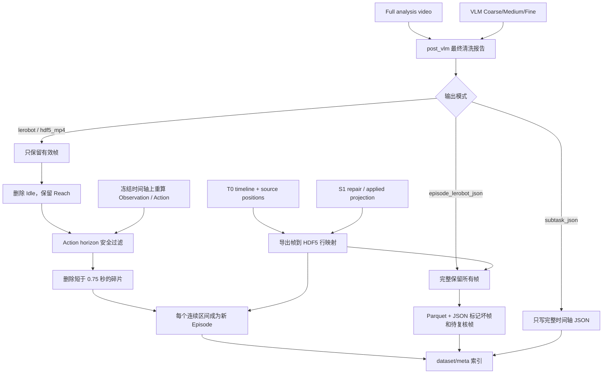

# 07 数据导出与 LeRobot 组织

## 1. 本章范围

本章说明清洗、VLM 和 C1/C2 完成后，系统如何把数据写成可迁移归档或训练数据，重点区分三条不同的导出链：

1. 顶部导出栏：导出 Manifest、已应用修改快照和可选源媒体；
2. Full 管道导出：按最终质量结论生成 LeRobot、HDF5+MP4 或 Episode JSON 包；
3. Nexus 专用转换器：把 Nexus v4 多传感器数据转换为 30 FPS LeRobot 数据集。

这三者用途不同，不能统称为同一种“导出”。

主要代码入口：

    app/storage.py::export_dataset()
    app/storage.py::export_zip()
    app/full_export.py::export_episode()
    app/full_export.py::write_dataset_index()
    app/lerobot_export.py::write_lerobot_pair()
    app/nexus_lerobot_export.py::convert_nexus_to_lerobot()

当前版本：

    Full export pipeline version: 8
    LeRobot codebase version declaration: v2.1
    Nexus LeRobot schema: alice/nexus-lerobot-dataset/v1

## 2. 三种导出入口

### 2.1 顶部导出栏

顶部“导出到文件夹”和“下载 ZIP”调用 `storage.export_dataset()` / `storage.export_zip()`。

它会输出：

- 清理过路径字段的 `manifest.json`；
- `changes/current.alice`；
- 已确认应用的修改快照；
- 用户勾选“包含媒体”时复制源视频、图像、HDF5、Parquet、JSON、NPY 等文件。

这条链的定位是可迁移项目归档，不执行：

- 坏帧裁剪；
- VLM 阶段过滤；
- MANO21 重组；
- LeRobot Parquet 写入；
- Action 与 Observation 对齐。

因此顶部导出栏不能替代 Full 训练数据导出。

### 2.2 Full 管道导出

Full 管道为每次运行创建独立目录：

    <dataset>/output/<full_run_id>/

它使用本次 Full run 冻结的：

- analysis video；
- timeline_id；
- T0 传感器映射；
- post_vlm 最终清洗报告；
- VLM Coarse/Medium/Fine 标注；
- 已应用投影归正结果；
- S1 修复补丁。

当前支持四种输出模式：

| 模式 | 用途 | 视频/数值帧策略 | 主要产物 |
|---|---|---|---|
| `lerobot` | 默认共享 LeRobot 数据集 | 只保留最终有效片段，删除 Idle、保留 Reach；请求 Action 时再执行 horizon 安全裁剪 | Parquet、MP4、meta |
| `hdf5_mp4` | 旧版兼容 | 与默认模式使用相同过滤 | 每片段 `data.hdf5 + video.mp4` |
| `subtask_json` | 旧版 JSON 兼容 | 不输出训练帧，只记录完整时间轴 | 每个源 Episode 一个 `subtasks.json` |
| `episode_lerobot_json` | 完整 Episode 包 | 所有帧都保留，坏帧/待复核帧同时写入 Parquet 与 JSON | 每 Episode 独立 LeRobot + `subtasks.json` |

### 2.3 Nexus 专用转换器

`convert_nexus_to_lerobot()` 是独立转换器，面向 Nexus v4 的：

- 30 FPS master timeline；
- 头部、左右腕部 RGB；
- 左右 DexWeaveG1 20 点骨架；
- 实验性 MANO21 位置；
- 左右 225 taxel 触觉；
- 头部 IMU；
- partial 与源序号审计字段。

Nexus 仍保持 `can_full_export=false`，因为它不能进入固定 MANO 4×4 默认导出器；但当 `can_nexus_mano21_adapter=true` 时，界面的“完整 Episode · LeRobot + JSON”按钮会把它分派到该专用转换器。Nexus 目前只接入 `episode_lerobot_json`，没有与默认共享 LeRobot schema 合并。

## 3. Full 导出的实际调用顺序



## 4. 标准过滤规则

### 4.1 质量状态

默认 `lerobot` 和 `hdf5_mp4` 只保留最终 curation 中 `state=valid` 的帧。

因此以下帧都会从训练片段中删除：

- 坏帧，即 `invalid`；
- 待复核帧，即 `uncertain/review`；
- 最终清洗 segments 没有覆盖的帧。

这里需要特别注意：标准导出不是“只删除坏帧”，而是坏帧和待复核帧都不进入输出。

### 4.2 VLM 阶段删除

质量过滤后，当前代码继续删除：

    idle

其他阶段，包括 Reach、Observe、Withdraw、Unknown、Grasp、Hold、Transport、Place 和 Release，仍可保留。

Reach/Approach 包含从视觉目标定位到末端接近的关键控制轨迹，因此当前版本默认保留。Idle 仍由导出策略删除，尚未提供独立的可配置开关。

### 4.3 碎片处理

默认参数：

    max_internal_gap_seconds = 0.25
    min_clip_seconds = 0.75

质量坏帧、待复核帧、未覆盖帧和 VLM 删除的 Idle 都被定义为禁止重新填补区域。因此这些短缺口不会被重新加入。

最终连续片段短于 0.75 秒时会整体丢弃。当前所谓 anti-fragment 的主要实际作用是删除短孤岛；由于所有初始非有效缺口都被 blocked，`merged_gap_frame_count` 在正常清洗报告上通常为 0。

### 4.4 片段重新编号

标准输出中，一个源 Episode 可能被切成多个 LeRobot Episode。每个输出片段：

- `frame_index` 从 0 重新开始；
- `episode_index` 使用输出数据集的连续编号；
- `index` 使用整个输出数据集的全局连续编号；
- `source.frame_index` 保留 analysis video 中的原始绝对帧号；
- `source.hdf5_position` 保留可为小数的传感器采样位置。

因此训练时间轴和源数据时间轴是两套坐标，必须通过 `source.*` 字段追溯。

## 5. 行为分类与任务标签

每个导出片段会根据与 Fine segments 的帧重叠计算：

- 占比最大的 phase_label；
- 占比最大的 primary_target；
- 占比最大的 target_instance；
- 片段分类置信度。

若全局 `task_label` 不是 other/unknown/unclassified，目录类别和 LeRobot task 直接使用全局 task_label。

若 task_label 过于通用，才退化为：

```text
dominant_phase + primary_target
```

例如：

    grasp_cup
    manipulate_usb_plug

Medium 子任务当前不会成为标准 LeRobot 的独立 task。标准 Parquet 每帧只写 `annotation.phase_label`，没有写 Fine `skill`、动作描述或 Medium subtask ID。

## 6. 默认 LeRobot 目录结构

```text
output/<run_id>/
├─ data/
│  └─ chunk-000/
│     ├─ episode_000000.parquet
│     └─ episode_000001.parquet
├─ body/
│  └─ chunk-000/
│     ├─ episode_000000.parquet
│     └─ episode_000001.parquet
├─ videos/
│  └─ chunk-000/
│     └─ observation.images.main/
│        ├─ episode_000000.mp4
│        └─ episode_000001.mp4
├─ meta/
│  ├─ info.json
│  ├─ stats.json
│  ├─ tasks.parquet
│  ├─ alice_state.json
│  └─ episodes/chunk-000/file-000.parquet
└─ dataset.json
```

每 1000 个 Episode 进入一个新 chunk。

## 7. 默认 LeRobot 主 Parquet 字段

### 7.1 手部与腕部

```text
observation.left_hand.transforms       [21, 4, 4]
observation.left_hand.confidence       [21]
observation.right_hand.transforms      [21, 4, 4]
observation.right_hand.confidence      [21]
observation.left_wrist.xyz_rot6d       [9]
observation.right_wrist.xyz_rot6d      [9]
```

左右手统一为固定 MANO21 关节顺序。EgoDex 原生结构会先经过掌部刚性拟合和相对关节旋转 FK；已应用的 MediaPipe/AlicePose 投影归正快照视为已经完成 MANO21 重定向。

### 7.2 相机

```text
observation.camera.transform           [4, 4]
observation.camera.intrinsic           [3, 3]
observation.camera.image_transform     [3, 3]
observation.images.main                MP4
```

若 analysis video 使用 EIS，系统逐帧写入图像变换，并计算：

```text
corrected_intrinsic = image_transform × source_intrinsic
```

因此视频稳像后的像素几何与导出的内参保持一致。

### 7.3 标注和源追溯

```text
annotation.phase_label
source.frame_index
source.hdf5_row
source.hdf5_position
source.video_frame_position
source.timestamp
timestamp
frame_index
episode_index
index
task_index
```

`source.hdf5_position` 支持小数，手部与相机 4×4 变换使用平移线性插值和旋转插值读取，不会简单四舍五入到最近 HDF5 行。

### 7.4 质量状态与可选 Action

所有默认 LeRobot 主 Parquet 都逐帧写入：

```text
quality.state                         valid | review | invalid
quality.is_bad                        bool
quality.needs_review                  bool
```

标准裁剪模式只输出有效帧，因此上述状态均为 valid；完整 Episode 模式保留真实三态，训练读取器无需依赖 JSON 才能屏蔽质量问题帧。

用户请求 Action 且 Action/S2 成功时，还会写入：

```text
observation.state                     [20]
action                                [action_dim]
action.target_source_frame_index      int64
quality.action_valid                  bool
```

Action 不是直接裁剪旧 Action artifact，而是在冻结后的 analysis timeline 上，使用最终 source positions、S1 修复与投影归正结果重新计算。`meta/info.json` 同时声明 profile、字段名、representation、coordinate frame 和 horizon。标准裁剪模式只保留 Action 有效且目标帧位于同一连续输出片段内的行；完整 Episode 模式保持原帧数，用 `quality.action_valid` 屏蔽 horizon 经过坏帧、待复核帧或超出尾部的行。

### 7.5 Body Parquet

源 HDF5 `transforms` 中除：

- 左手 21 点；
- 右手 21 点；
- camera；

之外，所有满足 `T×4×4` 的命名变换都会进入独立 Body Parquet：

```text
observation.body.transforms
observation.body.confidence
```

若没有额外 Body 关节，则不创建 body 目录。

## 8. HDF5 + MP4 兼容模式

兼容模式按 VLM task category 建立：

```text
<category>/
└─ epN/
   ├─ video.mp4
   └─ data.hdf5
```

`data.hdf5` 主要保存：

- `mano/transforms`，形状 `[T, 44, 4, 4]`；
- `camera/transform`；
- 相机内参和 EIS 图像变换；
- 左右腕部 xyz+rot6d；
- source frame、HDF5 row/position、source video position；
- 每帧 phase_label；
- 请求 Action 时的 `observation/state`、`action`、目标帧号和有效标志。

44 个 MANO/前臂节点由左右各 22 个节点组成：Forearm + MANO21。

该模式只是兼容旧消费者，不是默认格式。

## 9. Episode 完整 LeRobot + JSON 模式

### 9.1 目录结构

```text
output/<run_id>/episodes/<source_episode_id>/
├─ data/chunk-000/episode_000000.parquet
├─ body/chunk-000/episode_000000.parquet
├─ videos/chunk-000/observation.images.main/episode_000000.mp4
├─ meta/
└─ subtasks.json
```

每个源 Episode 是一个独立 LeRobot 数据集，不与其他 Episode 共用 episode_index。

### 9.2 帧保留策略

该模式完整保留 analysis video 的所有帧：

- 坏帧不删除；
- 待复核帧不删除；
- Idle/Reach 不删除；
- 不按质量区间切片。

质量结论同时写入主 Parquet 和 `subtasks.json`。若包含 Action，任何 horizon 穿过坏帧或待复核帧的行都会设置 `quality.action_valid=false`，但该行本身仍保留，保证 Episode 时间轴长度不变。

### 9.3 subtasks.json

一个 JSON 中包含多个 Medium 子任务。每个 Medium 子任务保存：

- 开始帧和结束帧；
- 开始时间和结束时间；
- description、confidence、boundary_source；
- primary_targets 和 target_instance；
- 该子任务内的坏帧、待复核帧；
- 与之重叠的多个 Fine segment。

Episode 顶层同时保存：

- `bad_frames`；
- `review_frames`；
- `bad_frame_ranges`；
- `review_frame_ranges`；
- 每段质量原因；
- source_frame_positions。

### 9.4 Parquet 逐帧质量字段

主 Parquet 与 JSON 使用同一份最终清洗状态，逐帧保存：

```text
quality.state
quality.is_bad
quality.needs_review
```

消费端应以 `quality.state=valid` 作为监督样本门禁；包含 Action 时还必须同时要求 `quality.action_valid=true`。JSON 继续承担 Medium/Fine 层级结构、质量区间原因和人工审阅信息，不再是质量 mask 的唯一来源。

## 10. Nexus 专用 LeRobot 输出

### 10.1 输出字段

Nexus 主 Parquet 保存：

- 左右源 20×7 skeleton；
- 左右实验性 MANO21 positions；
- MANO21 joint validity 和 MANO0 confidence；
- 掌宽；
- 左右 6 通道设备 joint；
- wrist quaternion；
- 左右 225 taxel 触觉；
- 7 维触觉统计；
- 头部 IMU 均值、样本数和有效性；
- Fine skill/phase 和 action description；
- partial 状态和原因；
- 所有主时钟、相机、触觉、mocap 源序号。

视频可选择：

```text
observation.images.head
observation.images.wrist_left
observation.images.wrist_right
```

所有输出按 Nexus 30 FPS master timeline 对齐。

### 10.2 与默认 LeRobot 格式不同

Nexus 输出的是：

```text
MANO21 [21, 3] positions
```

默认 Full LeRobot 输出的是：

```text
MANO21 [21, 4, 4] transforms
```

两者字段、robot_type 和多传感器结构不同，当前不能直接追加到同一个同构 LeRobot 数据集中。

### 10.3 Nexus 当前限制

- 不输出真实机器人 Action；
- 不输出 RGB 相机内参、mocap→RGB 外参或 RGB–Depth 外参；
- 不直接输出 depth 图像，只保存 depth source frame index；
- 原始深度、原频率触觉和 mocap 只能通过可选 raw sidecar 保留；
- MANO0 和 20→21 节点顺序仍标记为实验性。

Nexus 已接入 Full 的完整 Episode Package 路由，并在 Parquet 写入 `quality.curation_state`、`quality.is_bad`、`quality.needs_review`。没有提供清洗文档时，独立转换器允许导出完整 Episode；清洗文档明确存在但没有任何 valid segment 时，标准裁剪转换会返回空并报错，不再回退为整段导出。

当前 Nexus 路由仍以原始 30 FPS master timeline 和原始同步多相机视频作为输出源，不会用固定 MANO Full 导出器的 EIS 视频替换各相机流。系统会核对 Nexus 输出帧数与 Full 清洗时间轴帧数；不一致时安全失败，而不是静默错位。

## 11. Action 的当前实现

Full 界面提供“生成机器人 Action”选项。Action 阶段仍会生成用于 S2 审计的中间产物：

```text
.alicePD/actions/<profile>/<episode>.action.hdf5
```

正式导出不会直接按片段裁剪该旧数组。系统在 Full 冻结后的 analysis timeline 上重新读取最终 source positions，并叠加 S1 修复和已应用投影归正，然后重新计算：

- `observation.state`；
- `action`；
- target source frame index；
- `quality.action_valid`；
- profile、字段名、representation、坐标系和 horizon metadata。

标准 `lerobot` 与 `hdf5_mp4` 只保留 Action 有效的连续区间，Action target 不得越过坏帧、待复核帧、Idle 缺口或输出片段边界。horizon 导致的片段尾部会被删除；若删除后片段短于 0.75 秒，该碎片整体不输出。

完整 Episode 模式保持全部帧。无法形成未来 target、current/target 之间经过质量问题帧，或数值非有限的 Action 行，统一设置 `quality.action_valid=false`。训练时应同时使用质量 mask 与 Action mask。

如果用户明确请求 Action，但 Action 生成或 S2 校验失败，训练数据导出会被阻止，避免悄悄产出缺少 Action 的不完整数据；`subtask_json` 作为纯标注文档不受此限制。

需要明确：这里的 Action 是从手部轨迹按 profile 派生的训练目标，不等同于机器人控制器真实下发的电机命令、力矩或夹爪反馈。Nexus 当前仍没有真实机器人 Action。

## 12. 当前实现的优点

1. 源 HDF5、源视频和原始 Nexus 传感器文件保持只读。
2. 视频、Parquet/HDF5、相机和 Action 行数在写后进行一致性校验。
3. 临时文件完成后原子替换，失败时清理半成品。
4. 使用 T0 的小数采样位置，不把高帧率重采样粗暴量化为整数行。
5. S1 修复补丁在导出读取时应用，不修改源值。
6. 已应用的投影归正优先于原始手部变换。
7. EIS 图像变换和逐帧修正内参一起输出。
8. 固定左右 MANO21 顺序，并把其他命名变换分离到 Body。
9. Action 在最终 analysis timeline 上重算，并具有 horizon/片段边界保护。
10. 默认保留 Reach，只删除 Idle。
11. 主 Parquet 逐帧保存坏帧、待复核帧和 Action 有效状态。
12. Episode JSON 能在一个文件中同时保存多个 Medium 子任务、多段坏帧和待复核帧。
13. Nexus 完整 Episode 包已接入统一按钮，并保留骨架、触觉、IMU 和多相机视频。
14. Nexus 全坏帧清洗结果不再错误回退为整段有效数据。

## 13. 仍存在的不足与风险

### 13.1 P0：派生 Action 不等于真实机器人 Action

当前 Action 来自手部位姿的差分或目标映射，适合作为视觉模仿或 retargeting 监督，但缺少机器人本体状态、真实控制周期、执行器约束、夹爪反馈和控制器实际指令。训练具体机器人策略前仍需明确 profile 与目标 embodiment 的对应关系。

### 13.2 P1：标准输出丢失部分三级语义

主 Parquet 只有 `annotation.phase_label`。Grasp、Hold、Pinch 等可能映射到同一 phase，Medium subtask ID、Fine skill 和动作描述主要保存在 Episode JSON 中，标准共享模式无法只靠 Parquet 恢复完整层级标注。

### 13.3 P1：格式能力声明与实际读取器不完全一致

`can_full_export` 对部分 LeRobot/alice_full 数据可能返回 true，但固定导出器仍要求存在带 `transforms` 组的 HDF5。普通外部 LeRobot 数据集通常只有 Parquet/MP4，可能通过能力检查后在实际读取阶段失败。

### 13.4 P1：默认导出器仍带有 EgoDex 假设

固定 MANO metadata 的 `robot_type` 仍为 `egodex_bimanual_hands_body`；找不到源内参时也会使用 EgoDex 内参缩放回退。非 EgoDex 数据应继续建设独立 exporter adapter，不能把 Nexus/OpenXR 强行送入这一路径。

### 13.5 P1：Nexus 仍未统一视频几何与 Action

Nexus Episode Package 使用原始 30 FPS master timeline 和同步多相机视频，不复用固定 MANO Full 的 EIS 输出；也尚未写入 RGB 内参、mocap→RGB 外参、RGB–Depth 外参、depth 图像和真实机器人 Action。当前只通过帧数门禁防止 Full 清洗时间轴与 Nexus 输出静默错位。

### 13.6 P1：跨 Episode 合同过于严格

同一默认输出根要求 Episode 具有相同 FPS、视频分辨率、Body joint names、基础相机内参和 Action schema。这能防止静默混合异构数据，但多设备数据目前没有自动分组或分 shard 策略。

### 13.7 P1：LeRobot 兼容性仍包含 Alice 扩展

目录和索引接近 LeRobot v2.1，并已具备可选 `observation.state/action`，但尚未生成 `next.done` 等常见训练字段，`stats.json` 仍为空对象。训练框架需要显式理解 Alice 的 MANO、质量和 Action 扩展字段。

### 13.8 P2：Idle 策略尚未配置化

Reach 已默认保留，但 Idle 仍硬编码删除。对需要学习等待、稳定保持或时序条件的任务，应允许按数据集或任务配置保留策略。

### 13.9 P2：路径可移植性

`dataset.json` 的 pair 中保存多个绝对输出路径，并记录 source_root。移动输出目录后，这些路径可能失效，也可能泄露源机器目录结构。

### 13.10 P2：JSON 逐帧列表可能膨胀

`subtasks.json` 同时保存逐帧 bad/review 列表和连续 ranges。长 Episode 大面积质量问题时文件会明显增大；Parquet 已有固定长度质量列，因此后续可让 JSON 只保留 ranges 和原因。

## 14. 后续改进顺序

### 第一阶段：补足训练合同

1. 为派生 Action 补充单位、归一化范围、机器人 embodiment 和控制频率合同；
2. 生成真实 `stats.json`、done/terminal 字段和标准 train/validation split；
3. 增加独立训练读取测试，验证视频、state、action、质量 mask 和 horizon 语义。

### 第二阶段：完善语义监督

1. 逐帧写入 Fine skill、description 和 Medium subtask ID；
2. 写入 C2 evidence/quality 状态；
3. 将 Idle 保留策略配置化。

### 第三阶段：继续拆分模式适配器

1. 为 OpenXR 和外部 LeRobot/alice_full 建立独立 exporter adapter；
2. 对非 EgoDex 禁止 EgoDex 相机内参回退；
3. 明确 MANO21 positions 与 transforms 的可转换合同；
4. 为异构相机和 Action schema 自动分 shard。

### 第四阶段：完善 Nexus 多模态输出

1. 写入相机内外参和可选 depth；
2. 明确 Nexus 多相机 EIS/几何修正策略；
3. 接入真实机器人状态与 Action；
4. 将 raw sidecar、校验和与相对路径纳入发布合同。

## 15. 结论

当前导出系统已经完成几个关键修正：Action 正式进入默认 LeRobot 和 HDF5；Action 使用最终 Full 时间轴重新计算并禁止跨越质量缺口；Reach 默认保留；完整 Episode 的质量状态进入主 Parquet；Nexus 完整多传感器 Episode 包接入统一按钮；全坏帧不再回退为整段导出。

因此 EgoDex/固定 MANO 路径现在能够形成带视频、Observation、派生 Action、质量 mask、相机几何和源追溯的训练数据。剩余重点不再是“把 Action 写进去”，而是明确派生 Action 与真实机器人控制的差异、补齐标准训练合同，并继续为 Nexus、OpenXR 和外部 LeRobot 建立彼此隔离的导出适配器。
